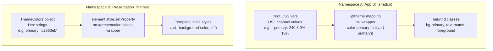

# TripStory -- Styling & UI Architecture Reference

> **Audience**: AI agents and human developers seeking styling-related answers.
> **Companion docs**: [`AGENTS.md`](AGENTS.md) (workspace facts & preferences), [`main-workflow.md`](main-workflow.md) (generation pipeline).
> **Scope**: Next.js frontend only (`servers/nextjs/`). Backend styling is limited to Jinja templates for PPTX export and is not covered here.

---

## 1. Stack Overview

| Layer | Technology | Version | Notes |
|---|---|---|---|
| CSS Framework | Tailwind CSS | v4.2.2 | CSS-first config (`@theme` block), **no `tailwind.config.ts`** |
| Build | PostCSS | via `@tailwindcss/postcss` | Single plugin in [`postcss.config.mjs`](servers/nextjs/postcss.config.mjs) |
| Component Library | shadcn/ui | "new-york" style | 28 components wrapping Radix primitives |
| Variant System | class-variance-authority (CVA) | ^0.7.0 | 4 components define variants |
| Class Merging | clsx + tailwind-merge | ^2.1.1 / ^2.5.3 | Composed as `cn()` in [`lib/utils.ts`](servers/nextjs/lib/utils.ts) |
| Icons | lucide-react | ^0.447.0 | Primary; @radix-ui/react-icons secondary |
| Charts | Recharts | ^2.15.4 | Sole charting lib; shadcn wrapper in `chart.tsx` |
| Rich Text | Tiptap | ^2.11.5 | StarterKit + Markdown + Underline extensions |
| Drag & Drop | @dnd-kit | core ^6.3.1 | Slide reordering + outline reordering |
| Color Picker | react-colorful | ^5.6.1 | Presentation theme editor |
| Toast | Sonner | ^2.0.6 | Heavily customized wrapper with dark-mode styles |
| State | Redux Toolkit | ^2.2.8 | 4 slices; theme data lives in `presentationGeneration` |
| Dark Mode | next-themes | ^0.4.6 | **Installed but dormant** -- no `ThemeProvider` wraps the app |
| Animations | tailwindcss-animate | ^1.0.7 | Plugin + 5 custom keyframes in `globals.css` |
| Typography | @tailwindcss/typography | ^0.5.16 | `.prose` classes for markdown content |

**Key architectural distinction**: the codebase maintains **two completely separate CSS variable namespaces** -- one for the app UI (shadcn, HSL-based) and one for presentation slide themes (hex-based, imperatively injected). See [Section 4](#4-color--theme-architecture).

---

## 2. File Map

### Core CSS & Configuration

| File | Purpose |
|---|---|
| [`servers/nextjs/app/globals.css`](servers/nextjs/app/globals.css) | **The entire CSS foundation.** Tailwind v4 `@import`, `@theme` block, `:root`/`.dark` variables, keyframe animations, prose overrides, scrollbar styles, PrismJS syntax token colors. ~617 lines. |
| [`servers/nextjs/postcss.config.mjs`](servers/nextjs/postcss.config.mjs) | Single `@tailwindcss/postcss` plugin. |
| [`servers/nextjs/components.json`](servers/nextjs/components.json) | shadcn/ui config: "new-york" style, zinc base color, RSC enabled, CSS variables enabled. Aliases: `@/components/ui`, `@/lib/utils`. |
| No `tailwind.config.ts` | Tailwind v4 uses the CSS-first `@theme` block instead. |

### Component Library

| File | Purpose |
|---|---|
| [`servers/nextjs/components/ui/`](servers/nextjs/components/ui/) | 28 shadcn/ui primitives (25 standard + 3 custom). Full inventory in [Section 6](#6-component-library-inventory). |
| [`servers/nextjs/lib/utils.ts`](servers/nextjs/lib/utils.ts) | `cn()` utility: `clsx` for conditional composition, `twMerge` for Tailwind class deduplication. |

### Font System

| File | Purpose |
|---|---|
| [`servers/nextjs/app/layout.tsx`](servers/nextjs/app/layout.tsx) | Loads 3 fonts via `next/font`: Inter (local), Syne (Google), Unbounded (Google). Sets CSS variables `--font-inter`, `--font-syne`, `--font-unbounded` on `<body>`. |
| [`servers/nextjs/app/fonts/Inter.ttf`](servers/nextjs/app/fonts/Inter.ttf) | Local Inter font file (weight 400). |
| [`servers/nextjs/app/presentation-templates/travel/TravelFonts.tsx`](servers/nextjs/app/presentation-templates/travel/TravelFonts.tsx) | Memoized `<link>` for Poppins (travel templates only). |

### Presentation Theme System

| File | Purpose |
|---|---|
| [`servers/nextjs/app/(presentation-generator)/(dashboard)/theme/components/ThemePanel/`](servers/nextjs/app/(presentation-generator)/(dashboard)/theme/components/ThemePanel/) | Theme editor UI directory. |
| `ThemePanel/constants.ts` | 10 built-in theme presets (colors + font pairings) and 23 Google Font presets (`FONT_OPTIONS`). |
| `ThemePanel/types.ts` | `ThemeColors` interface defining 16 hex color tokens. |
| [`servers/nextjs/app/(presentation-generator)/presentation/hooks/usePresentationData.ts`](servers/nextjs/app/(presentation-generator)/presentation/hooks/usePresentationData.ts) | Imperatively injects theme CSS variables onto `#presentation-slides-wrapper` via `element.style.setProperty()`. |

### Template System

> See also: [`AGENTS.md`](AGENTS.md) documents the template registration pattern, travel template group details, and enricher auto-discovery. [`main-workflow.md`](main-workflow.md) traces how templates interact with the 3-call LLM pipeline and the schema-driven constraint chain.

| File | Purpose |
|---|---|
| [`servers/nextjs/app/presentation-templates/`](servers/nextjs/app/presentation-templates/) | 10 template groups, ~134 layout components total. |
| `presentation-templates/index.tsx` | Master registry. `createTemplateEntry()` + lookup helpers (`getLayoutByLayoutId`, `getSchemaByTemplateId`, `getTemplatesByTemplateName`). |
| `presentation-templates/utils.ts` | Shared types (`TemplateWithData`, `TemplateLayoutsWithSettings`), `getSchemaDefaults()`, `getSchemaJSON()`, `createTemplateEntry()`. |
| `presentation-templates/defaultSchemes.ts` | Shared Zod schemas: `ImageSchema` (`__image_url__`, `__image_prompt__`), `IconSchema` (`__icon_url__`, `__icon_query__`). |
| `presentation-templates/ExampleSlideLayout.tsx` | Documented reference for contributors writing new layouts. |

### Slide Rendering Pipeline

> See also: [`main-workflow.md`](main-workflow.md) Section 5 ("Frontend Rendering") traces the full data flow from SSE stream to rendered slide, including the `V1ContentRender` dispatch logic and asset replacement.

| File | Purpose |
|---|---|
| [`servers/nextjs/app/(presentation-generator)/components/V1ContentRender.tsx`](servers/nextjs/app/(presentation-generator)/components/V1ContentRender.tsx) | Central dispatcher: resolves layout component, wraps in editing wrappers, injects theme/branding. |
| [`servers/nextjs/app/(presentation-generator)/components/EditableLayoutWrapper.tsx`](servers/nextjs/app/(presentation-generator)/components/EditableLayoutWrapper.tsx) | In-place editing: scans DOM for ``/`<svg>`/Recharts elements, opens image/icon/chart editors on click. |
| [`servers/nextjs/app/(presentation-generator)/components/TiptapTextReplacer.tsx`](servers/nextjs/app/(presentation-generator)/components/TiptapTextReplacer.tsx) | DOM walker that replaces text nodes with inline Tiptap editors for live text editing. |
| [`servers/nextjs/app/(presentation-generator)/components/PresentationRender.tsx`](servers/nextjs/app/(presentation-generator)/components/PresentationRender.tsx) | Scales slides from native 1280x720 to fit container via `ResizeObserver` + CSS `transform: scale()`. |

### State Management

> See also: [`AGENTS.md`](AGENTS.md) documents SSE streaming resilience layers in `usePresentationStreaming.ts` (try/finally, 2-min timeout, onerror recovery).

| File | Purpose |
|---|---|
| [`servers/nextjs/store/store.ts`](servers/nextjs/store/store.ts) | Redux store with 4 slices. |
| `store/slices/presentationGeneration.ts` | Core slice: slides, outlines, theme, streaming flags, slide CRUD. Theme data (`Theme \| null`) lives here. |
| `store/slices/presentationGenUpload.ts` | Upload config (files, settings from upload page). |
| `store/slices/userConfig.ts` | LLM provider config and `can_change_keys` flag. |
| `store/slices/undoRedoSlice.ts` | Undo/redo history stack (max 30 entries). |

### App Shell & Layout

| File | Purpose |
|---|---|
| [`servers/nextjs/app/layout.tsx`](servers/nextjs/app/layout.tsx) | Root layout: `<html>` > `<body>` > `<Providers>` (Redux) > `<MixpanelInitializer>` > children + `<Toaster>`. |
| [`servers/nextjs/app/providers.tsx`](servers/nextjs/app/providers.tsx) | Redux `<Provider store={store}>` wrapper. |
| [`servers/nextjs/app/(presentation-generator)/layout.tsx`](servers/nextjs/app/(presentation-generator)/layout.tsx) | Wraps all presentation routes in `<ConfigurationInitializer>` (LLM config validation + route guard). |
| [`servers/nextjs/app/(presentation-generator)/(dashboard)/layout.tsx`](servers/nextjs/app/(presentation-generator)/(dashboard)/layout.tsx) | Sidebar layout for dashboard, settings, theme, templates pages. |

---

## 3. Tailwind v4 Configuration

Tailwind v4 uses a CSS-first configuration approach. All config lives in [`globals.css`](servers/nextjs/app/globals.css), not a JS/TS config file.

### Entry Point (lines 1-6)

```css
@import 'tailwindcss';
@plugin "@tailwindcss/typography";
@plugin "tailwindcss-animate";
@custom-variant dark (&:is(.dark *));
```

- `@import 'tailwindcss'` replaces the old `@tailwind base; @tailwind components; @tailwind utilities;` trio.
- `@plugin` is v4's inline plugin registration syntax.
- `@custom-variant dark` defines class-based dark mode: any descendant of `.dark` matches the `dark:` variant.

### `@theme` Block (lines 8-70)

The `@theme` block registers design tokens that become Tailwind utility classes:

**Semantic Colors** (13 pairs):

```css
--color-background: hsl(var(--background));
--color-foreground: hsl(var(--foreground));
--color-card: hsl(var(--card));
--color-card-foreground: hsl(var(--card-foreground));
--color-popover: hsl(var(--popover));
--color-popover-foreground: hsl(var(--popover-foreground));
--color-primary: hsl(var(--primary));
--color-primary-foreground: hsl(var(--primary-foreground));
--color-secondary: hsl(var(--secondary));
--color-secondary-foreground: hsl(var(--secondary-foreground));
--color-muted: hsl(var(--muted));
--color-muted-foreground: hsl(var(--muted-foreground));
--color-accent: hsl(var(--accent));
--color-accent-foreground: hsl(var(--accent-foreground));
--color-destructive: hsl(var(--destructive));
--color-destructive-foreground: hsl(var(--destructive-foreground));
--color-border: hsl(var(--border));
--color-input: hsl(var(--input));
--color-ring: hsl(var(--ring));
```

**Chart Colors** (5): `--color-chart-1` through `--color-chart-5`.

**Border Radius Tokens** (3):

```css
--radius-lg: var(--radius);           /* 8px (from --radius: 0.5rem) */
--radius-md: calc(var(--radius) - 2px); /* 6px */
--radius-sm: calc(var(--radius) - 4px); /* 4px */
```

**Font Families** (3): `--font-syne`, `--font-unbounded`, `--font-inter` -- enabling `font-syne`, `font-unbounded`, `font-inter` utilities.

**Animations** (2): `--animate-accordion-down`, `--animate-accordion-up` with keyframes using `--radix-accordion-content-height`.

### Custom Utility (line 90)

```css
@utility text-balance { text-wrap: balance; }
```

### What Is NOT Customized

No custom spacing scale, breakpoints, screens, or container queries. The project uses Tailwind's default values for all of these.

---

## 4. Color & Theme Architecture

This is the most nuanced part of the codebase. Two independent CSS variable systems coexist, serving different purposes and using different color formats.



### Namespace A -- App UI (HSL-based, CSS cascade)

Defined in `globals.css` `:root` (light) and `.dark` (dark). Raw HSL channel values (no `hsl()` wrapper) in `:root`, wrapped by the `@theme` block to produce Tailwind-ready colors.

**Light mode palette:**

| Token | HSL Value | Approximate |
|---|---|---|
| `--background` | `0 0% 100%` | White |
| `--foreground` | `240 10% 3.9%` | Near-black |
| `--primary` | `240 5.9% 10%` | Dark blue-gray |
| `--primary-foreground` | `0 0% 98%` | Near-white |
| `--secondary` | `240 4.8% 95.9%` | Light gray |
| `--muted` | `240 4.8% 95.9%` | Light gray |
| `--muted-foreground` | `240 3.8% 46.1%` | Mid-gray |
| `--accent` | `240 4.8% 95.9%` | Light gray |
| `--destructive` | `0 84.2% 60.2%` | Bright red |
| `--border` | `240 5.9% 90%` | Light gray |
| `--ring` | `240 10% 3.9%` | Near-black |

**Dark mode** (`.dark` class): fully inverted -- background becomes near-black, foreground becomes near-white, all 13 color pairs are overridden. Chart colors are remapped to a different palette. However, **dark mode is dormant in practice**: no `<ThemeProvider>` from `next-themes` wraps the app, so the `.dark` class is never applied to `<html>`. The infrastructure is ready but not activated.

### Namespace B -- Presentation Themes (hex-based, imperative injection)

Applied at runtime by `usePresentationData.ts` and `ThemeSelector.tsx` via `element.style.setProperty()` onto the `#presentation-slides-wrapper` DOM element.

**16 color tokens** defined in `ThemeColors` interface:

| CSS Variable | TypeScript Key | Purpose |
|---|---|---|
| `--primary-color` | `primary` | Accent/brand color |
| `--background-color` | `background` | Slide background |
| `--card-color` | `card` | Content card backgrounds |
| `--stroke` | `stroke` | Border/separator color |
| `--primary-text` | `primary_text` | Text on primary-colored surfaces |
| `--background-text` | `background_text` | Text on background |
| `--graph-0` .. `--graph-9` | `graph_0` .. `graph_9` | 10-color chart/graph palette |

**2 font variables**: `--heading-font-family`, `--body-font-family`.

**How templates consume these**: every slide layout uses inline `style` attributes with CSS variable fallbacks:

```tsx
style={{ background: "var(--background-color, #ffffff)" }}
style={{ color: "var(--background-text, #111827)" }}
style={{ fontFamily: "var(--heading-font-family, Poppins)" }}
style={{ borderColor: "var(--stroke, #e5e7eb)" }}
```

The fallback values ensure slides render correctly even without an applied theme.

### Built-In Themes

10 default presets in `ThemePanel/constants.ts`, each defining all 16 colors + a font pairing. Examples: "Edge Yellow" (dark bg, yellow accent, Playfair Display), "Light Rose" (rose bg, dark text). Custom themes are created via a 4-step wizard with AI palette generation via `/api/v1/ppt/theme/generate`.

---

## 5. Typography System

Three independent font layers serve different parts of the application.

### Layer 1: App UI Fonts

Loaded in [`layout.tsx`](servers/nextjs/app/layout.tsx) via `next/font`:

| Font | Source | Weight(s) | CSS Variable | Role |
|---|---|---|---|---|
| Inter | Local TTF | 400 | `--font-inter` | Body default |
| Syne | Google Fonts | 400-800 | `--font-syne` | Display/brand |
| Unbounded | Google Fonts | 400-800 | `--font-unbounded` | Display/brand |

Applied to `<body>` as CSS variable classes. The body font stack (in `globals.css`):

```css
body {
  font-family: var(--font-inter), var(--font-unbounded), var(--font-syne), sans-serif;
}
```

Registered in the `@theme` block as `--font-syne`, `--font-unbounded`, `--font-inter`, enabling Tailwind utilities `font-syne`, `font-unbounded`, `font-inter`.

### Layer 2: Presentation Theme Fonts

23 Google Font presets in `ThemePanel/constants.ts` (`FONT_OPTIONS` array): Inter, DM Sans, Overpass, Barlow, Nunito, Lora, Instrument Sans, Roboto Slab, Montserrat, Libre Baskerville, Prompt, Inconsolata, Fraunces, Gelasio, Raleway, Kanit, Corben, Poppins, Open Sans, Lato, Source Sans Pro, Playfair Display, Roboto.

Custom font upload is supported (`.ttf`, `.otf`, `.woff`, `.woff2`). Fonts are loaded dynamically by the `useFontLoader` hook and injected as `--heading-font-family` / `--body-font-family` CSS variables on the slide wrapper.

### Layer 3: Template-Specific Fonts

Travel template layouts load Poppins via a shared memoized component `TravelFonts.tsx`:

```tsx
const TravelFonts = memo(() => (
    <link href="https://fonts.googleapis.com/css2?family=Poppins:wght@400;500;600;700&display=swap" rel="stylesheet" />
));
```

Non-travel templates that need specific fonts (e.g., Poppins, Montserrat) use inline `<link>` tags directly in the component JSX.

### Prose Typography Overrides

The `@tailwindcss/typography` plugin provides `.prose` classes for markdown content. Heading sizes are capped in `globals.css` (lines 442-482) to prevent full-size headings inside the markdown editor:

| Heading | Size |
|---|---|
| `.prose h1` | 18px |
| `.prose h2` | 16px |
| `.prose h3` | 14px |
| `.prose h4` | 12px |
| `.prose h5` | 11px |
| `.prose h6` | 10px |

---

## 6. Component Library Inventory

### shadcn/ui Components (28 total)

All live in [`servers/nextjs/components/ui/`](servers/nextjs/components/ui/).

**Standard shadcn components (25):**

| Component | Radix Primitive | Has CVA Variants |
|---|---|---|
| `accordion.tsx` | `@radix-ui/react-accordion` | No |
| `button.tsx` | `@radix-ui/react-slot` | **Yes** (6 variants + 4 sizes) |
| `card.tsx` | native HTML | No |
| `chart.tsx` | Recharts | No |
| `collapsible.tsx` | `@radix-ui/react-collapsible` | No |
| `command.tsx` | `cmdk` + Dialog | No |
| `dialog.tsx` | `@radix-ui/react-dialog` | No |
| `input.tsx` | native HTML | No |
| `label.tsx` | `@radix-ui/react-label` | **Yes** (base styles only) |
| `popover.tsx` | `@radix-ui/react-popover` | No |
| `progress.tsx` | `@radix-ui/react-progress` | No |
| `radio-group.tsx` | `@radix-ui/react-radio-group` | No |
| `scroll-area.tsx` | `@radix-ui/react-scroll-area` | No |
| `select.tsx` | `@radix-ui/react-select` | No |
| `separator.tsx` | `@radix-ui/react-separator` | No |
| `sheet.tsx` | `@radix-ui/react-dialog` | **Yes** (4 side variants) |
| `skeleton.tsx` | native HTML | No |
| `slider.tsx` | `@radix-ui/react-slider` | No |
| `sonner.tsx` | Sonner library | No |
| `switch.tsx` | `@radix-ui/react-switch` | No |
| `table.tsx` | native HTML | No |
| `tabs.tsx` | `@radix-ui/react-tabs` | No |
| `textarea.tsx` | native HTML | No |
| `toggle.tsx` | `@radix-ui/react-toggle` | **Yes** (2 variants + 3 sizes) |
| `tooltip.tsx` | `@radix-ui/react-tooltip` | No |

**Custom components (3)** -- these do NOT follow shadcn theme token patterns:

| Component | What It Does | Styling Concern |
|---|---|---|
| `loader.tsx` | Spinner | Hardcoded `border-purple-200 border-t-purple-600` |
| `overlay-loader.tsx` | Full-screen overlay + spinner | Hardcoded `bg-[#030303]`, `border-white/10` |
| `progress-bar.tsx` | Animated gradient progress | Hardcoded `#9034EA`, `#5146E5` via `<style jsx>` |

### CVA Pattern

The `buttonVariants` export is the most reused CVA definition. The pattern across all 4 CVA components:

1. `cva()` call with base classes and `variants` / `defaultVariants` object.
2. Props interface extends `VariantProps<typeof xxxVariants>`.
3. Component uses `cn(xxxVariants({ variant, size, className }))` for final class resolution.

`buttonVariants` (6 visual variants):

| Variant | Key Classes |
|---|---|
| `default` | `bg-primary text-primary-foreground shadow hover:bg-primary/90` |
| `destructive` | `bg-destructive text-destructive-foreground shadow-sm hover:bg-destructive/90` |
| `outline` | `border border-input bg-background shadow-sm hover:bg-accent` |
| `secondary` | `bg-secondary text-secondary-foreground shadow-sm hover:bg-secondary/80` |
| `ghost` | `hover:bg-accent hover:text-accent-foreground` |
| `link` | `text-primary underline-offset-4 hover:underline` |

### Sonner Toast Customization

The `sonner.tsx` wrapper is heavily customized beyond standard shadcn:

- Custom `notify` helper with typed `error`, `success`, `info` methods.
- Extensive `<style jsx global>` with color-coded left border accents (green/red/blue/amber/violet) for 5 toast types.
- Full `.dark [data-sonner-toast]` overrides (dark mode toast styles are ready despite app dark mode being dormant).
- `useTheme()` from `next-themes` for theme-aware rendering.

### cmdk Usage

The `command.tsx` component is used as a **searchable combobox** (not a standalone command palette). Always paired with `Popover` + `PopoverContent`:

- Image provider selection (`ImageSelectionConfig.tsx`)
- LLM provider picker (`TextProvider.tsx`)
- Language selector (`LanguageSelector.tsx`)

---

## 7. Third-Party Visual Libraries

### Icons

**lucide-react** (primary) -- used in 65+ files. Named imports of individual icons:

```tsx
import { Loader2, Check, Plus, X, ChevronRight } from "lucide-react";
```

Most frequent: `Loader2` (spinners), `Check`/`ChevronsUpDown` (combobox patterns), `Plus`/`X` (add/close).

**@radix-ui/react-icons** (secondary) -- used in a handful of places: `ArrowLeftIcon`, `PlusIcon`, `Cross2Icon`, `ChevronDownIcon`, `DotFilledIcon`, `MagnifyingGlassIcon`.

**Static SVGs** in `/public`: `card_bg.svg` (card decoration), `pdf.svg`/`ppt.svg` (file type icons), `image-markup.svg`, `logo-with-bg.png`.

### Charts (Recharts)

Sole charting library, used in 30+ presentation template files.

`components/ui/chart.tsx` wraps Recharts with a `ChartConfig` context that maps data keys to CSS variables (`--color-{key}`), enabling theme-aware chart colors. Exports: `ChartContainer`, `ChartTooltip`, `ChartTooltipContent`, `ChartLegend`, `ChartLegendContent`, `ChartStyle`.

Chart types used across templates: `BarChart`, `LineChart`, `PieChart`, `AreaChart`, `ScatterChart` with `ResponsiveContainer`, `CartesianGrid`, `XAxis`, `YAxis`, `Tooltip`, `Legend`.

`globals.css` defines 5 chart colors (`--chart-1` through `--chart-5`) for the app UI charts. Presentation templates use the 10-color `--graph-0` through `--graph-9` palette from the theme system.

### Rich Text (Tiptap)

Three components form the rich text system:

| Component | Purpose | Extensions |
|---|---|---|
| `TiptapText.tsx` | Inline slide text editor with BubbleMenu (Bold, Italic, Underline, Strikethrough, Code) | StarterKit, Markdown, Underline |
| `TiptapTextReplacer.tsx` | DOM walker that replaces text nodes with `TiptapText` instances via `ReactDOM.createRoot` | -- |
| `MarkdownEditor.tsx` | Simple outline editor, no bubble menu, updates on every keystroke | StarterKit, Markdown |

`TiptapTextReplacer` skips tables, SVGs, Recharts charts, mermaid diagrams, form elements, and layout containers.

### Drag and Drop (@dnd-kit)

Two independent DnD contexts:

| Context | Location | Strategy |
|---|---|---|
| Slide reordering | `presentation/components/SidePanel.tsx` | `verticalListSortingStrategy` with `PointerSensor` (8px activation) + `KeyboardSensor` |
| Outline reordering | `outline/components/OutlineContent.tsx` | `verticalListSortingStrategy` with same sensors; `arrayMove` from `@dnd-kit/sortable` |

### Color Picker (react-colorful)

Single usage in the theme editor: `ThemePanel/ColorPickerComponent.tsx`. Uses `HexColorPicker` (visual) + `HexColorInput` (text field). AI palette generation is offloaded to the backend (`/api/v1/ppt/theme/generate`).

### Code Editor (react-simple-code-editor + PrismJS)

Single usage: `custom-template/components/EachSlide/HtmlEditor.tsx` for editing custom template HTML. PrismJS grammar: `prism-clike` > `prism-javascript` > `prism-markup` > `prism-jsx`. Syntax theme defined in `globals.css` lines 548-617 via `.token.*` classes.

### Export / Screenshot

> See also: [`main-workflow.md`](main-workflow.md) Section 6 ("Export Pipeline") details how Puppeteer renders slides server-side and the full PPTX/PDF export flow.

- **html-to-image**: `toPng()` captures slide DOM as data URLs in `custom-template/hooks/useSlideEdit.ts`. Two captures: one filtering out canvas, one including.
- **Puppeteer** (server-side): renders slides at 1280x720 viewport for PDF/PPTX export.

### Dynamic Layout Compilation

`@babel/standalone` compiles user-created custom template layouts at runtime in `hooks/compileLayout.ts`. The compiled code receives injected globals: React, zod, Recharts (`import * as Recharts`), and d3.

### Animations

**No framer-motion.** All animations are CSS-based:

| Animation | Keyframe | Duration | Purpose |
|---|---|---|---|
| `accordion-down` / `accordion-up` | `@theme` block | 0.2s ease-out | Radix accordion height transitions |
| `typing` | `globals.css:201` | 2s stepped | Typewriter text reveal |
| `blink` | `globals.css:235` | 1s infinite | Cursor blinking |
| `slideUp` / `slideDown` | `globals.css:290-308` | 20s linear infinite | Vertical scroll animations (pause on hover) |
| `rippleEffect` | `globals.css:345` | 0.6s ease-out | Radial gradient expansion for "research mode" |

Additionally: `tailwindcss-animate` plugin provides `animate-spin` (used with `Loader2`), `animate-pulse` (skeleton states), and data-attribute-driven enter/exit animations (`animate-in`, `animate-out`, `slide-in-from-*`).

---

## 8. Layout & Scaling System

### Slide Dimensions

All slides render at a fixed **1280 x 720** pixel canvas (16:9 aspect ratio). This is enforced in every template layout:

```tsx
className="w-full rounded-sm max-w-[1280px] shadow-lg max-h-[720px] aspect-video bg-white relative z-20 mx-auto overflow-hidden"
```

Constants defined in [`PresentationRender.tsx`](servers/nextjs/app/(presentation-generator)/components/PresentationRender.tsx):

```tsx
const BASE_WIDTH = 1280;
const BASE_HEIGHT = 720;
```

### CSS Transform Scaling

Slides are always rendered at native 1280x720 and then CSS-transform-scaled to fit their container. The pattern: `transform: scale(N)` from `transform-origin: top left`, wrapped in a container with `height: 720 * N` to collapse visual space.

| Context | Scale Factor | Method |
|---|---|---|
| Main editor | Dynamic | `ResizeObserver` -> `scale = min((containerWidth / 1280) * 0.98, 1)` |
| Side panel thumbnails | 0.125 (12.5%) | Fixed constant |
| Template preview grid | 0.12 (12%) | `scale-[0.12]` + `width: 833.33%` inverse |
| New slide picker | 0.2 (20%) | `scale-[0.2]` + `width: 500%` inverse |
| Theme preview | Dynamic | `containerWidth / 1280` via `ResizeObserver` |
| Presentation mode | Viewport-fitted | `aspectRatio: "16/9"`, `min(90vw, calc(88vh * 16/9))` |
| PPTX/PDF export | 1:1 | Puppeteer viewport `1280x720`, `deviceScaleFactor: 1` |

### Responsive Design

The **app shell** (dashboard, navigation, sidebar) uses standard Tailwind responsive breakpoints (`sm:`, `md:`, `lg:`, `xl:`):

- Grid layouts scale: `grid-cols-1 md:grid-cols-2 lg:grid-cols-4`
- Text show/hide at breakpoints: `hidden md:inline`
- Padding scales: `px-5 sm:px-10 lg:px-20`
- Flex direction changes: `flex xl:flex-row flex-col`

**Slide templates are NOT responsive.** They render at fixed 1280x720 and are scaled via CSS transforms. This is intentional: slides must produce identical output for PPTX/PDF export.

---

## Quick-Reference: Template Registration

> See also: [`AGENTS.md`](AGENTS.md) has a condensed version of this pattern plus the backend registration step in `constants/presentation.py`.

Adding a new template layout follows this 5-step pattern (documented in `ExampleSlideLayout.tsx`):

1. **Create the layout component** exporting 5 named exports:
   - `layoutId` (string)
   - `layoutName` (string)
   - `layoutDescription` (string)
   - `Schema` (Zod schema with `.default()`, `.meta()`, `.min()`, `.max()` on every field)
   - `default` export (React component accepting `{ data: InferredType }`)

2. **Use `__double_underscore__` convention** for AI-editable media fields: `__image_url__`, `__image_prompt__`, `__icon_url__`, `__icon_query__`. These are scanned by `EditableLayoutWrapper` and used by the backend for asset generation.

3. **Import and register** in `presentation-templates/index.tsx` using `createTemplateEntry()`.

4. **Add a `settings.json`** with `description`, `ordered` (boolean), and `default` (boolean).

5. **Register the group name** in `DEFAULT_TEMPLATES` in the backend Python constants (`constants/presentation.py`).

The composite layout ID format is `"templateGroupName:layoutId"` (e.g., `"general:general-intro-slide"`).

---

## Quick-Reference: Provider Hierarchy

```html
<html lang="en">
  <body className="${inter.variable} ${unbounded.variable} ${syne.variable} antialiased">
    <Providers>                              <!-- Redux Provider -->
      <MixpanelInitializer>                  <!-- Analytics (passthrough) -->
        <ConfigurationInitializer>           <!-- LLM config + route guard (presentation routes only) -->
          {page content}
        </ConfigurationInitializer>
      </MixpanelInitializer>
    </Providers>
    <Toaster position="top-center" />        <!-- Sonner toast (root level) -->
  </body>
</html>
```

No `ThemeProvider` from `next-themes` is present. If dark mode activation is desired, add `<ThemeProvider attribute="class">` wrapping `<Providers>`.

---

## Quick-Reference: CSS Files

Only **2 CSS files** exist in the entire frontend:

| File | Lines | Purpose |
|---|---|---|
| `app/globals.css` | ~617 | Everything: Tailwind config, theme tokens, animations, prose overrides, scrollbars, PrismJS syntax theme |
| `app/(presentation-generator)/upload/styles/main.module.css` | ~33 | CSS Module for a custom switch toggle (Radix-style, hardcoded `blueviolet`/`white` colors) |
