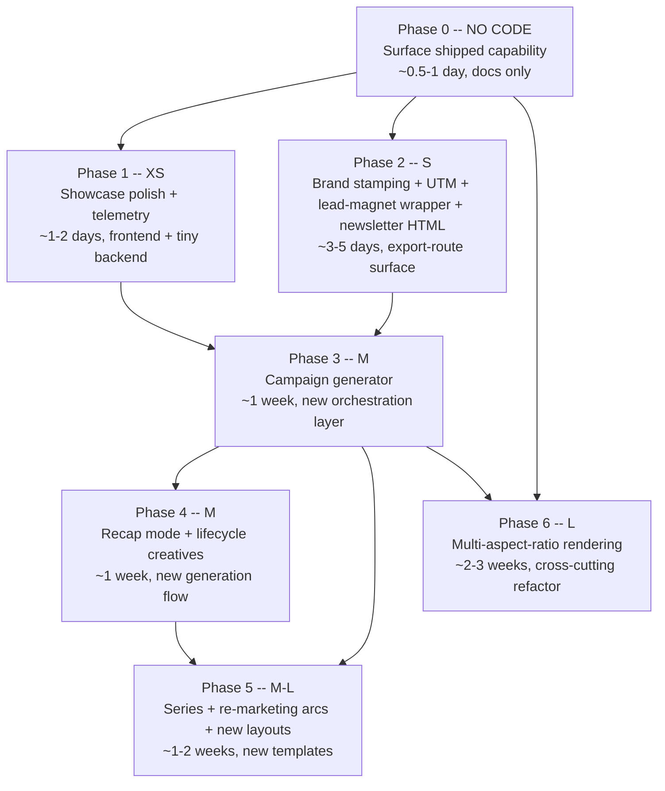
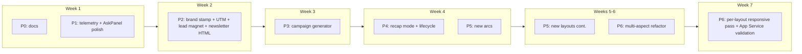

# FEATURE-BUILDING.md -- TripStory Content Syndication Engine

## Status: Phases 0-6 Shipped (May 2026) — all carve-outs closed; Phase 1 showcase Mixpanel events landed in commit `20cca156`

This document is the source of truth for turning TripStory from "AI itinerary builder" into "AI travel content engine for marketing-grade syndication." It is the companion forward-looking master plan to [REFACTOR-PIVOT.MD](REFACTOR-PIVOT.MD) (the travel pivot, Phases 0-12 done) and [FEAT-EXPANSION.md](FEAT-EXPANSION.md) (the enrichment pipeline, Phases A-E done).

Cross-references: [stakeholder.md](stakeholder.md), [EXPORTS.md](EXPORTS.md), [CONTRIBUTING.md](CONTRIBUTING.md), [main-workflow.md](main-workflow.md), [TROUBLESHOOTING.md](TROUBLESHOOTING.md), [AGENTS.md](AGENTS.md).

---

## 1. Vision

TripStory's first chapter (Phases 0-12 in [REFACTOR-PIVOT.MD](REFACTOR-PIVOT.MD)) shipped a **client-personalized itinerary builder** -- one prompt becomes one polished proposal for one named client. That product works. The pipeline is grounded in real data, narrated end-to-end, exportable to six formats, MCP-ready.

The next chapter is the **content / syndication engine**. Travel agents and BDMs do not only need client proposals; they need to **drum up business**. They need:

- Top-of-funnel demand creation that pulls strangers into a discovery call.
- Mid-funnel nurture and re-marketing that keeps a known prospect warm and turns past clients into repeat clients.
- Trust and authority content that positions the agent as the destination expert.
- Sales conversion artifacts that close the deal once a client is ready.
- Lead-magnet interactives that capture contact data on the agent's website.
- Newsletter and email-shaped pieces that fit the channels where buyers actually read proposals.
- Partner co-marketing assets (DMOs, hotels, airlines) that fund the agent's content production.

**The strategic insight: TripStory already has roughly 80% of the engine to produce all of those creatives.** Thirty travel layouts are shipped ([servers/nextjs/app/presentation-templates/travel/](servers/nextjs/app/presentation-templates/travel/)). Ten narrative arcs are shipped, nine of them not even itineraries (`travel-itinerary`, `travel-reveal`, `travel-contrast`, `travel-audience`, `travel-micro`, `travel-local`, `travel-series`, `travel-recap`, `travel-deal-flash`, `travel-partner-spotlight` -- see [servers/nextjs/app/presentation-templates/index.tsx](servers/nextjs/app/presentation-templates/index.tsx) lines 810-873). Six export formats and showcase mode are shipped. Seventeen enrichers plus pricing are shipped. Mem0 per-presentation memory plus AI Q&A pills are shipped.

What we are building in this plan is **distribution polish, packaging, and one big aspect-ratio refactor** -- not a second generation engine.

## 2. Architecture Principle

> **Every phase ships independently. Every phase reuses the shipped engine. We do not duplicate generation; we extend distribution.**

Mirroring the [FEAT-EXPANSION.md graceful-degradation rule](FEAT-EXPANSION.md#graceful-degradation-rule), this plan is governed by five principles:

- **Leverage shipped infra.** The 3-call pipeline, the 17 enrichers, the 6 export formats, the showcase + `is_public` infrastructure, the narration tone presets, the AskPanel/AskHotspotPill widgets, the Mem0 memory layer, and the Mixpanel telemetry all already exist. Every phase below uses them.
- **Documentation is a feature.** Half of what travel agents need on day one already works -- they just have not been told the recipes. Phase 0 ships *only* documentation and pays for itself.
- **Lift-ordered execution.** Cheap leverage first. Heavy refactors only when the cheap leverage is exhausted.
- **Distribution polish before new generation.** Brand stamping, UTM tagging, packaging, and aspect ratios unlock the existing engine for new channels. New generation modes (recap, series) come after distribution.
- **Every phase produces ship-ready output.** No phase is "infrastructure only." Every phase ends with a creative artifact a travel agent can hand to a client or post on social.

### What Is NOT Being Built Here

- Direct booking APIs (Amadeus, Skyscanner, Booking.com, Expedia). Already on the [stakeholder.md Q4 2026 roadmap](stakeholder.md#q4-2026).
- Mapbox / Google Maps JavaScript interactive embeds. Roadmap.
- Multi-currency live pricing. Roadmap.
- Multi-tenant architecture. Roadmap.
- Marketing site at `servers/marketing/`. Planned in a separate doc.
- Anthropic prompt caching, Call 3 streaming parallelization, Call 2 schema-aware layout assignment. These are perf optimizations to the existing generation pipeline; tracked in [REFACTOR-PIVOT.MD Performance & Cost Optimization](REFACTOR-PIVOT.MD#performance--cost-optimization-not-yet-implemented).

These are listed in Section 9 (Adjacent / Out of Scope) for visibility; they are not interleaved into the lift-ordered phases below.

---

## 3. The Strategic Frame

### 3.1 Funnel-Stage Map

Travel agents need a portfolio of creatives, not one. Each funnel stage demands a different shape. The grid below is what we are unlocking; every phase below maps to one or more cells.

| Stage | Goal | Creative shape | Best format | Best arc |
| --- | --- | --- | --- | --- |
| **Top of funnel** | Pull strangers into discovery | Reels / shorts, IG carousels, Pinterest pin packs | MP4 9:16 / 1:1, HTML embed | `travel-reveal`, `travel-contrast`, `travel-micro` |
| **Mid-funnel nurture** | Keep prospects warm | Newsletter inserts, deal-of-the-week, audience-specific decks | Newsletter HTML, MP4 16:9, embed | `travel-audience`, `travel-micro` |
| **Trust / authority** | Position the agent as expert | Local-perspective destination guides, visa/safety explainers, cuisine deep-dives | HTML embed, PDF, blog-shaped HTML | `travel-local`, `travel-itinerary` |
| **Sales conversion** | Close the deal | Quote pages, single-resort spotlights, comparison decks | PPTX, PDF, configurator embed | `travel-itinerary` (subset), `travel-contrast` |
| **Lead-magnet interactive** | Capture contact info on agent's website | Pricing configurator, style quiz, "build your trip" wizard | Showcase embed, HTML embed | Standalone widget slides |
| **Newsletter / email** | Fit the actual buyer channel | Trip-of-the-week, monthly destination spotlight | Newsletter HTML | `travel-micro`, `travel-itinerary` |
| **Partner co-marketing** | Hotel / airline / DMO funded content | Partner spotlights, route guides, destination catalogs | PPTX, MP4, HTML embed | `travel-itinerary` (subset), new `travel-partner-spotlight` (Phase 5) |
| **Re-marketing / lifecycle** | Past clients become repeat clients | Welcome-home recaps, anniversary nudges | MP4 16:9, newsletter HTML | New `travel-recap` (Phase 4 + 5) |

### 3.2 Capability x Creative-Type Matrix

What the existing engine can already produce, today, with parameter changes only. The recipes below assume the documented `POST /api/v1/ppt/presentation/generate` shape from [EXPORTS.md Section 1](EXPORTS.md#1-generate--export-one-shot).

| Creative type | Template (arc) | Tone | Narration tone | Export | `slide_duration` | Public? |
| --- | --- | --- | --- | --- | --- | --- |
| Destination spotlight Reel-style video | `travel-reveal` | `adventurous` | `hype_reel` | `video` | 3 sec | -- |
| 48-hour micro-share | `travel-micro` | `adventurous` | `hype_reel` | `video` | 4 sec | -- |
| Solo / couple / family carousel | `travel-audience` | `inspirational` | `travel_companion` | `html` | -- | yes |
| Local-perspective SEO embed | `travel-local` | `casual` | `documentary` | `html` (embed) | -- | yes |
| Contrast hook video | `travel-contrast` | `adventurous` | `documentary` | `video` | 5 sec | -- |
| Pricing configurator widget | `travel` (subset, single layout) | `professional` | n/a | embed | -- | yes |
| AI Q&A on a destination | any travel arc + AskHotspotPill | -- | -- | embed | -- | yes |
| Standard client itinerary | `travel-itinerary` | `professional` | `travel_companion` | `pptx` / `pdf` | -- | -- |
| Cuisine deep-dive | `travel` filtered to `CuisineDiscoveryLayout` + `LanguageSurvivalLayout` | `casual` | `documentary` | `html` | -- | yes |
| Visa / passport explainer | `travel` filtered to `VisaEntryLayout` + `HealthSafetyLayout` | `professional` | `friendly_tutorial` | `html` / `pdf` | -- | yes |
| Sensory mood board | `travel` filtered to `GoldenHourMoodBoardLayout` + `AmbientSoundsLayout` + `DayNightSplitLayout` | `inspirational` | `documentary` | `html` (showcase) | -- | yes |

The four canonical narration tone presets (`travel_companion`, `documentary`, `hype_reel`, `friendly_tutorial`) are defined in [servers/fastapi/constants/narration.py](servers/fastapi/constants/narration.py) and remain unchanged in this plan -- we are not adding new tones, only documenting and surfacing the combinations.

### 3.3 What Is Already Working (Don't Rebuild)

- **3-call generation pipeline** ([servers/fastapi/utils/llm_calls/](servers/fastapi/utils/llm_calls/)): outlines, structure, content. Per-call model routing via [servers/fastapi/utils/llm_config.py](servers/fastapi/utils/llm_config.py).
- **17 enrichers + pricing** ([servers/fastapi/enrichers/](servers/fastapi/enrichers/)) with graceful degradation, itinerary scheduler, and overlay.
- **All 6 export formats** ([EXPORTS.md](EXPORTS.md)): PPTX, PDF, HTML zip, MP4 video, JSON, embed.
- **Showcase mode + `is_public`** ([servers/fastapi/api/v1/public/](servers/fastapi/api/v1/public/)): public-first fetches, visibility toggle, embed gating. Just shipped.
- **Per-layout AI Q&A** (`AskHotspotPill` + `AskPanel`): grounded by `enriched_data` plus Mem0 memory, with optional `topic` hint. Endpoint: `POST /api/v1/ppt/showcase/ask` and `POST /api/v1/public/showcase/ask`.
- **Pricing Configurator widget** ([PricingConfiguratorLayout.tsx](servers/nextjs/app/presentation-templates/travel/PricingConfiguratorLayout.tsx)): interactive widget, `viewMode`-aware, dynamic 2-tier vs 3-tier grid.
- **Mem0 per-presentation memory** ([servers/fastapi/services/mem0_presentation_memory_service.py](servers/fastapi/services/mem0_presentation_memory_service.py)): `retrieve_context()` integrated into showcase QA.
- **Webhook subscription layer** ([servers/fastapi/api/v1/webhook/router.py](servers/fastapi/api/v1/webhook/router.py)): `presentation.generation.completed`, `presentation.generation.failed` events. Phase 3 extends with a campaign event.
- **Mixpanel telemetry helpers** ([servers/nextjs/utils/mixpanel.ts](servers/nextjs/utils/mixpanel.ts)): `track()` and `trackEvent()` ready; Phase 1 wires showcase events.
- **MCP server** at `/mcp/`: 14+ tools auto-registered from FastAPI OpenAPI spec.

The bottom-line meta-frame: **this plan is light on net-new code and heavy on activating shipped capability.**

---

## 4. Phases (Lift-Ordered)

The phases below are ordered strictly by **implementation lift**, not by chronological dependency. Phase 0 is documentation only. Phase 6 is a cross-cutting refactor. Phases 1-5 are small to medium incremental builds. Each phase ships standalone; you can cherry-pick.



The arrows are *recommended* sequencing, not strict dependencies. Phase 6 specifically depends on having stable export routes (Phase 2 brand stamping touches the same files), so it ships last.

---

### Phase 0 -- NO CODE: Surface Shipped Capability

**Lift: 0.5-1 day. Docs only. Zero code change.**

The single highest-leverage move in this entire plan is documenting the recipes we already support. Five non-itinerary narrative arcs are registered in production right now ([servers/nextjs/app/presentation-templates/index.tsx](servers/nextjs/app/presentation-templates/index.tsx) lines 277-282), but they are invisible to travel agents because the upload UI does not present them as named creative formats.

#### Phase 0 -- Deliverables

- **New file**: `docs/CREATIVE-RECIPES.md` (or extend [EXPORTS.md](EXPORTS.md) with an appendix). One curl block per recipe. Each recipe = (prompt template + `template` + `tone` + `narration_tone` + `export_as` + `slide_duration` + showcase mode flag).
- **Cover the matrix in section 3.2** at minimum:
  - Reel-shaped MP4 from `travel-reveal`
  - 48-hour micro-share from `travel-micro`
  - Audience carousel from `travel-audience`
  - Local-perspective SEO embed from `travel-local`
  - Contrast hook video from `travel-contrast`
  - Pricing configurator embed (single layout)
  - AI Q&A pill on any showcase deck
  - Sensory mood board (filtered layout subset)
  - Visa explainer (filtered layout subset)
- **Cross-link** from [README.md](README.md) "Sharing as Showcase" subsection (just shipped) and [stakeholder.md](stakeholder.md) Section 4D (Export & Sharing).
- **Marketing copy seed**: a one-page "what TripStory can produce" cheat sheet that lives in `docs/` for sales/marketing use. This is ALSO non-code -- it ships from the same matrix.

#### Phase 0 -- Acceptance

- A travel agent reading `docs/CREATIVE-RECIPES.md` can produce ten distinct creatives from one trip prompt without writing any code or asking the team for help.
- The five non-itinerary arcs are documented as named creative formats with intended channels.
- `docs/CREATIVE-RECIPES.md` is referenced from [README.md](README.md) and [EXPORTS.md](EXPORTS.md).

#### Phase 0 -- Out of Scope

- Surfacing arc presets in the upload UI -- that is a Phase 1 code task.
- Branding the assets -- that is Phase 2.
- Multi-aspect MP4 -- that is Phase 6.

---

### Phase 1 -- XS: Showcase Polish & Telemetry Backlog

**Lift: 1-2 days. Frontend + tiny backend. ~6-8 file diffs.**

Three items here ride on the just-shipped showcase + `is_public` infrastructure. None of the syndication phases below are measurable without this phase. This phase also formalizes the deferred-polish backlog from the showcase audit ([showcase-mode-hindsight-audit_8b451902.plan.md](.cursor/plans/showcase-mode-hindsight-audit_8b451902.plan.md)) Phase C items.

#### 1.1 Mixpanel showcase events

Wire the four events the showcase audit deferred. Use the existing [servers/nextjs/utils/mixpanel.ts](servers/nextjs/utils/mixpanel.ts) `trackEvent()` helper.

| Event | Where | Payload |
| --- | --- | --- |
| `Showcase_View_Loaded` | [EmbedPlayer.tsx](servers/nextjs/app/embed/[id]/EmbedPlayer.tsx) on first slide-data fetch in showcase mode | `{presentationId, isPublic, sourcePath: "public" \| "private"}` |
| `Showcase_Public_Toggle` | [EmbedShareDialog.tsx](servers/nextjs/app/(presentation-generator)/presentation/components/EmbedShareDialog.tsx) on PATCH /visibility success | `{presentationId, newValue}` |
| `Showcase_Ask_Submitted` | [AskPanel.tsx](servers/nextjs/app/embed/[id]/AskPanel.tsx) on submit | `{presentationId, slideId, hasTopic, viewMode}` |
| `Showcase_Configurator_Tier_Changed` | [PricingConfiguratorLayout.tsx](servers/nextjs/app/presentation-templates/travel/PricingConfiguratorLayout.tsx) interactive branch on tier select | `{presentationId, slideId, tierIndex, currency}` |

#### 1.2 Rate-limit `/showcase/ask` endpoints

In-memory token bucket per `presentation_id` (target 30 req/min, configurable env var). Apply to both [servers/fastapi/api/v1/ppt/endpoints/showcase.py](servers/fastapi/api/v1/ppt/endpoints/showcase.py) and [servers/fastapi/api/v1/public/showcase.py](servers/fastapi/api/v1/public/showcase.py) via shared FastAPI dependency. Return 429 with a `Retry-After` header on overflow. No Redis dependency yet -- in-memory is enough for v1; revisit when Phase 3 campaign volume justifies it.

#### 1.3 Multi-turn AskPanel memory

Pass last 5 turns to grounding context. Frontend: extend [AskPanel.tsx](servers/nextjs/app/embed/[id]/AskPanel.tsx) to keep an in-component history buffer; include in request body. Backend: extend `AskRequest` in [showcase.py](servers/fastapi/api/v1/ppt/endpoints/showcase.py) and the public sibling with an optional `history: list[{role: "user" | "assistant", content: str}]` field. Wire into [showcase_qa.py](servers/fastapi/utils/showcase_qa.py) `build_grounded_context()` so previous turns prepend the system prompt with a focus hint. Bump output token cap modestly if needed.

#### 1.4 Surface 5 narrative arcs in upload UI

Currently the upload page does not present the non-itinerary arcs as creative formats. Add a chip selector below the template picker on [TravelUploadPage.tsx](servers/nextjs/app/(presentation-generator)/upload/components/TravelUploadPage.tsx) that lets the agent choose: "Standard itinerary" (default `travel-itinerary`), "Reveal hook" (`travel-reveal`), "Contrast hook" (`travel-contrast`), "Audience tracks" (`travel-audience`), "48-hour micro-share" (`travel-micro`), "Local's perspective" (`travel-local`). Persist the choice into the existing `template` field on the generation request.

#### 1.5 AGENTS.md workspace fact

[AGENTS.md](AGENTS.md) line 54 already captures the showcase + `is_public` fact (added by the continual-learning pass). Verify the wording is durable; extend it only if Phase 1 lands new persistent surface area (e.g., the chip selector becomes a stable UI fixture worth recording).

#### Phase 1 -- Deliverables

- 4 Mixpanel events emitted; verified in dashboard.
- 429 response observable on burst test against `/showcase/ask`.
- AskPanel multi-turn memory verified by a 5-turn conversation that references prior turns.
- Upload page chip selector visible and functional, persisting to `template` field.

#### Phase 1 -- Acceptance

- All four Mixpanel events appear in the project's Mixpanel dashboard with the documented payloads.
- A test client hitting `/api/v1/public/showcase/ask` 31 times in 60 seconds receives a 429 on attempt 31.
- AskPanel can have a 5-turn conversation where turn 5 references turn 2 and the answer is grounded.
- A travel agent can select one of the 5 non-itinerary arcs from the upload page.

#### Phase 1 -- Out of Scope

- Brand stamping (Phase 2).
- Aspect-ratio rendering (Phase 6).

---

### Phase 2 -- S: Brand Stamping, UTM, Lead-Magnet Wrapper, Newsletter HTML

**Lift: 3-5 days. Mostly Next.js export routes + small alembic migration. ~12-15 file diffs.**

Every syndicated asset needs to be branded as the agent's. This phase touches the shared export-routing layer ([servers/nextjs/app/api/](servers/nextjs/app/api/)) and ships four small distribution-polish features.

#### 2.1 Agent profile / brand record

A small data model addition. New columns on `PresentationModel` (or sibling `AgentProfile` model -- design decision below). Suggested fields:

- `brand_logo_url: str | None`
- `brand_contact_card: dict | None` (name, email, phone, agency, optional certifications)
- `default_utm_source: str | None`
- `default_utm_medium: str | None`
- `default_utm_campaign: str | None`

Alembic migration mirroring the shape of [4b7f8e2c1d9a_add_presentation_is_public.py](servers/fastapi/alembic/versions/4b7f8e2c1d9a_add_presentation_is_public.py).

**Open design decision (Section 8)**: per-presentation brand override vs. single agent-profile row. v1 recommendation: per-presentation override that defaults to the agent profile if set; this keeps Phase 2 scope narrow without committing to multi-tenant data model.

#### 2.2 Brand-stamp pass at export

Auto-prepend logo watermark and append a contact-card slide using existing layout primitives. Hook into the four export pipelines:

- **Video**: [servers/nextjs/lib/video-export-composition.ts](servers/nextjs/lib/video-export-composition.ts) -- inject logo as a top-right absolutely-positioned element in the GSAP composition; append a contact-card final frame.
- **HTML zip**: [servers/nextjs/app/api/export-as-html/route.ts](servers/nextjs/app/api/export-as-html/route.ts) -- inline logo CSS background, append contact-card section.
- **PDF**: bundled converter path -- header/footer overlay (Puppeteer `page.pdf({headerTemplate, footerTemplate})`).
- **PPTX**: [servers/nextjs/app/api/presentation_to_pptx_model/route.ts](servers/nextjs/app/api/presentation_to_pptx_model/route.ts) -- inject logo per slide via python-pptx layer.

The contact-card slide should use a generic-template layout (not travel) so it is reusable across template groups in the future.

#### 2.3 UTM tagger at export

At export time, rewrite booking-CTA URLs to add UTM parameters:

```text
?utm_source={agent_profile.default_utm_source || "tripstory"}
&utm_medium={export_format}
&utm_campaign={presentation_id}
&utm_content={slide_index || layout_id}
```

Apply to all booking-CTA layout fields ([BookingCTALayout.tsx](servers/nextjs/app/presentation-templates/travel/BookingCTALayout.tsx)) and Viator booking URLs (set in [ExperienceCardsLayout.tsx](servers/nextjs/app/presentation-templates/travel/ExperienceCardsLayout.tsx) data, populated by [activities enricher](servers/fastapi/enrichers/activities.py)).

Implementation: a small `applyUtmTags(slideContent, options)` utility called inside the four export-route handlers before serialization.

#### 2.4 Lead-magnet wrapper

When `export_options.lead_magnet=true` is passed to the PDF export route, the PDF gets:

- A branded cover page (auto-generated from agent profile: logo + headline + agency)
- Existing slides untouched
- A branded back-page CTA ("Book a discovery call: {agent_email}" + QR code if Phase 2.5 ships QR codes)

Acceptance: an agent can use the same showcase as both an interactive embed and a downloadable lead-magnet PDF for "subscribe to download" landing pages.

#### 2.5 (Optional) QR code on PDF / PPTX exports

Stretch goal in Phase 2. Append a QR code to each export pointing back at the showcase embed URL. This unlocks "scan to view interactive version" on print proposals. Already on the [stakeholder.md Q3 2026 roadmap](stakeholder.md#q3-2026); fold it in here if it fits the timebox.

#### 2.6 Newsletter HTML variant

Single-column, email-client-safe HTML output. New export option `email_safe: true` on [export-as-html/route.ts](servers/nextjs/app/api/export-as-html/route.ts). Differences from the existing showcase HTML:

- Single column, max-width 600px
- Inline narration as `<a href="audio/slide_N.mp3">Play</a>` link instead of `<audio>` embed (most email clients block `<audio>`)
- Tested rendering targets: Gmail, Outlook, Apple Mail
- No JavaScript -- email clients strip JS

Document in [EXPORTS.md Section 5](EXPORTS.md#5-interactive-embed) under a new "Email-safe HTML" subsection.

#### Phase 2 -- Deliverables

- Migration applied; agent-profile fields populated by upload form.
- Logo + contact card visible in all four export formats.
- UTM parameters present on every booking URL in exports.
- Lead-magnet PDF wrapping verified on a sample showcase.
- Email-safe HTML opens cleanly in Gmail and Outlook.

#### Phase 2 -- Acceptance

- All four export formats stamp the agent's logo and contact details.
- A booking URL exported in PPTX, opened in a browser, lands on the booking site with `utm_campaign=<presentation_id>` visible in the URL.
- The same presentation produces a polished lead-magnet PDF and a clean newsletter HTML.

#### Phase 2 -- Out of Scope

- Vertical / square aspect ratios (Phase 6).
- Multi-tenant agent profile (single-admin auth assumption holds; multi-tenant is on the [stakeholder.md roadmap](stakeholder.md#q3-2026)).

---

### Phase 3 -- M: Campaign Generator

**Lift: 1 week. New orchestration layer + new UI flow. ~10-15 file diffs.**

The single deepest unlock in this plan. Treat one client brief as a **campaign of N coordinated creative variants**, not one deck. The goal: a travel agent types one prompt about Iceland, ticks four boxes (Reels MP4, IG audience carousel, lead-magnet PDF, configurator embed), clicks Generate, and 3 minutes later has four ship-ready assets.

This phase does **not** add a new generation engine. It adds **orchestration around the existing engine**.

#### 3.1 Backend: campaign endpoint

New endpoint: `POST /api/v1/ppt/campaign/generate`

Request body:

```json
{
  "content": "5-day Iceland Northern Lights trip, mid-budget, couples, departing from JFK",
  "trip_plan": { "destination": "Iceland", "duration": 5, ... },
  "variants": [
    {
      "name": "reel",
      "template": "travel-reveal",
      "tone": "adventurous",
      "narration_tone": "hype_reel",
      "export_as": "video",
      "slide_duration": 3,
      "brand_stamp": true
    },
    {
      "name": "audience-carousel",
      "template": "travel-audience",
      "tone": "inspirational",
      "narration_tone": "travel_companion",
      "export_as": "html",
      "is_public": true,
      "brand_stamp": true
    },
    {
      "name": "lead-magnet",
      "template": "travel-itinerary",
      "tone": "professional",
      "export_as": "pdf",
      "lead_magnet": true,
      "brand_stamp": true
    },
    {
      "name": "configurator",
      "template": "travel",
      "layout_filter": ["travel-pricing-configurator"],
      "export_as": "embed",
      "is_public": true
    }
  ]
}
```

Response: `{ "campaign_id": "...", "statusUrl": "/api/v1/ppt/campaign/status/{campaign_id}" }` -- async.

#### 3.2 Backend: campaign job runner

**Design decision A**: one source presentation, N export passes (cheaper, less narrative variety).
**Design decision B**: N independent presentations sharing the same `TravelContext` (more variety, more LLM cost, more storage).

v1 recommendation: **hybrid** -- group variants by `template`. Variants that share the same `template` reuse a single source presentation; variants on different templates each get their own. This minimizes LLM cost while preserving narrative variety where it matters.

Status endpoint: `GET /api/v1/ppt/campaign/status/{campaign_id}` returns per-variant status (pending / generating / exporting / done / failed) and a `bundleUrl` once all done.

File-backed job store mirroring the shape of [video-export-jobs](servers/nextjs/lib/video-export-jobs.test.mjs) -- atomic writes, 24h reaper.

#### 3.3 Frontend: campaign UI

New page route: `/campaign` (or extend the upload page with a "Create campaign" mode toggle). Layout:

- Same trip-brief form (prompt, trip plan popover, client CRM sheet) as the upload page.
- Below the form: a **checkbox grid of preset variants** (Reels MP4, IG audience carousel, lead-magnet PDF, configurator embed, newsletter HTML, partner-spotlight PPTX, etc.). Each preset is a saved variant config from section 3.1.
- Generate button -> progress dashboard showing per-variant status -> bundled download link.

#### 3.4 Webhook integration

Extend [servers/fastapi/enums/webhook_event.py](servers/fastapi/enums/webhook_event.py) with:

- `campaign.generation.completed`
- `campaign.generation.failed`

Subscribers can pull the bundled assets via the `bundleUrl` and push to connected social tools / CMS / email platforms.

#### 3.5 MCP tool

Add `generate_campaign` to the MCP server (auto-registered from the OpenAPI spec). Documented in [EXPORTS.md MCP section](EXPORTS.md#7-mcp-integration).

#### Phase 3 -- Deliverables

- Campaign endpoint wired and tested with 4-variant input.
- Async job runner with file-backed status store.
- Campaign UI route producing 4 ship-ready assets from one prompt.
- Webhook events firing; tested against a sample subscriber.
- MCP tool exposed.

#### Phase 3 -- Acceptance

- One prompt produces 4 distinct ship-ready creatives in a single campaign.
- Status endpoint progresses through `queued -> running -> done` without manual intervention.
- Bundle download contains exactly the variants requested.
- Webhook subscriber receives `campaign.generation.completed` with the bundle URL.

#### Phase 3 -- Out of Scope

- Multi-aspect ratios (Phase 6) -- campaign variants in v1 are all 16:9 landscape.
- Recap / lifecycle creatives as variants (Phase 4 ships those generation modes; Phase 3 just orchestrates).

---

### Phase 4 -- M: Recap Mode + Lifecycle Creatives

**Lift: 1 week. New generation prompt mode + small frontend flow. ~6-10 file diffs.**

Today's pipeline assumes pre-trip. A **post-trip / recap** mode unlocks an entire re-marketing surface area: welcome-home memory pieces, anniversary nudges, repeat-client trip suggestions. The data already exists -- every past presentation's JSON export is a structured record of what the trip *was*.

#### 4.1 Recap input mode

Two ways in:

- From an existing presentation `id` -- the canonical case. Pulls slides + enriched_data + booking outcomes (if Phase 2 booking-link tracking exists).
- From a JSON export blob -- import an external trip record.

New endpoint: `POST /api/v1/ppt/presentation/recap` taking either `source_presentation_id: uuid` or `source_json: dict` plus a `mode` field:

- `welcome_home` -- "Your Bali trip in 60 seconds" (right after the trip)
- `anniversary` -- "One year ago today you were in Reykjavík" (12 months later)
- `next_planning_window` -- "Ready for trip number two?" (~6-9 months later)

The endpoint generates a new presentation reusing the same generation pipeline but with a new prompt template and a new tone preset. `narration_tone: "documentary"` works today for `welcome_home`; `hype_reel` works for `anniversary`. No new tone presets needed.

#### 4.2 New prompt files

Three small additions to [servers/fastapi/utils/llm_calls/](servers/fastapi/utils/llm_calls/):

- `generate_recap_outline.py` (or extend the existing `generate_presentation_outlines.py` with a `recap_mode` branch) -- takes the source trip data and emits an outline framed as memory rather than plan.
- The structure and content calls (Calls 2 and 3) remain unchanged; they don't care whether the source is plan or recap.

#### 4.3 Frontend recap entry point

Dashboard card: "Past trips" view that lists existing presentations and offers "Create recap" actions. Single-click -> recap mode endpoint -> standard editor experience -> standard export.

#### 4.4 Lifecycle triggers (manual / scriptable, no scheduler)

v1 ships **no scheduler**. The recap endpoint is callable directly. Document the cron recipe pattern:

```text
crontab: 0 9 * * 1   curl ... /api/v1/ppt/presentation/recap?mode=anniversary&source_presentation_id=...
```

A future phase (out of scope here, on the [stakeholder.md Q4 roadmap](stakeholder.md#q4-2026)) introduces a built-in scheduler tied to multi-tenant agent profiles.

#### Phase 4 -- Deliverables

- Recap endpoint with three modes.
- Source from existing presentation `id` works end-to-end.
- New prompt template tested for narrative quality (memory tone, not planning tone).
- Dashboard "Past trips -> Create recap" flow.
- One sample anniversary cron recipe in `docs/`.

#### Phase 4 -- Acceptance

- Calling `/recap?source_presentation_id=...&mode=welcome_home` produces a presentation that reads as memory not plan.
- The agent can flow from past trip -> recap edit -> export PPTX/MP4 in under 3 minutes.
- The same recap endpoint as a Phase 3 campaign variant produces a bundled "memory + anniversary + next-planning-window" set.

#### Phase 4 -- Out of Scope

- Built-in scheduler (Q4 roadmap).
- Cross-deck "trip series" (this is Phase 5 -- a series of *future* trips; recap is the past).

---

### Phase 5 -- M-L: Series Templates + Re-Marketing Arcs + New Layouts

**Lift: 1-2 weeks. Net-new ordered arc templates + possibly new layouts. Each new arc ~1 day.**

Phase 5 creates the *templates* that Phase 3 (campaign generator) and Phase 4 (recap) will surface as preset options. These follow the existing `ordered: true` pattern documented in [REFACTOR-PIVOT.MD Phase 7](REFACTOR-PIVOT.MD) and [Phase 11](REFACTOR-PIVOT.MD).

#### 5.1 New ordered arc templates

For each, create a directory under `servers/nextjs/app/presentation-templates/`, add a `settings.json` with `ordered: true`, register in [index.tsx](servers/nextjs/app/presentation-templates/index.tsx), mirror in [servers/fastapi/constants/presentation.py](servers/fastapi/constants/presentation.py) `DEFAULT_TEMPLATES`.

| New arc | Description | Layout sequence |
| --- | --- | --- |
| `travel-series` | Multi-destination coherent set ("5 Caribbean Islands Compared") | DestinationHero x N -> CompareDestinations -> PricingComparison -> BookingCTA |
| `travel-recap` | Post-trip memory / anniversary | DestinationHero -> ItineraryDay (memory tone) -> CuisineDiscovery -> Testimonial (the client's own words) -> BookingCTA (next trip) |
| `travel-deal-flash` | Short countdown promo | DestinationHero -> DealCountdown -> PackageInclusions -> BookingCTA |
| `travel-partner-spotlight` | Hotel / airline / DMO co-marketing | DestinationHero -> AccommodationCard or FlightInfo (partner) -> ExperienceCards -> BookingCTA |

The `travel-recap` arc pairs naturally with Phase 4's recap endpoint. The `travel-deal-flash` arc fills the gap that `travel-micro` cannot (urgency framing). The other two unlock new use cases.

#### 5.2 Possible new layouts

The 26 shipped layouts cover most cases. Likely gaps surfaced by Phase 5 use cases:

- **Memory-quote layout** -- testimonial variant for recap arcs where the testimonial is the *client's own* words.
- **Series-cover layout** -- "5 destinations, one decision" hero card for `travel-series`.
- **Partner-spotlight hero** -- branded version of DestinationHero with partner logo and copy block.

Each new layout follows the registration triple from [AGENTS.md](AGENTS.md) (React component + Zod schema + `settings.json` per group, mirrored in Python `DEFAULT_TEMPLATES`).

#### 5.3 Re-marketing tone defaults

Extend [TONE_TEMPLATE_DEFAULTS in narration.py](servers/fastapi/constants/narration.py):

```python
"travel-recap":             TonePreset.DOCUMENTARY
"travel-deal-flash":        TonePreset.HYPE_REEL
"travel-series":            TonePreset.TRAVEL_COMPANION
"travel-partner-spotlight": TonePreset.TRAVEL_COMPANION
```

#### Phase 5 -- Deliverables

- 4 new ordered arc templates registered, frontend + backend.
- 2-3 new layouts (only those required by the arcs above).
- Tone defaults extended.
- Each new arc demoed end-to-end with a sample prompt.

#### Phase 5 -- Acceptance

- A travel agent can choose `travel-series` from the upload chip selector (Phase 1) and produce a 5-island comparison deck.
- Phase 3 campaign generator surfaces `travel-deal-flash` and `travel-partner-spotlight` as preset variants.
- Phase 4 recap endpoint defaults to `travel-recap` for `mode=anniversary`.

#### Phase 5 -- Out of Scope

- Aspect-ratio rendering (Phase 6).
- Direct booking API integration for partner-spotlight ([Q4 roadmap](stakeholder.md#q4-2026)).

---

### Phase 6 -- L: Multi-Aspect-Ratio Rendering

**Lift: 2-3 weeks. Cross-cutting refactor across export pipeline. ~20+ file diffs + per-layout responsive validation.**

The biggest single lever for social syndication. Today the entire export pipeline assumes 1280x720 landscape. Adding 9:16 (vertical / Reels / TikTok / Shorts) and 1:1 (Instagram square) is what turns the existing engine from "16:9 deck builder" into "creative engine for every social channel."

This phase is intentionally last because it touches every export route plus every layout.

#### 6.1 Hardcoded sites of 1280x720

Confirmed via grep. All seven need parameterizing:

| File | Line | Context |
| --- | --- | --- |
| [servers/nextjs/lib/video-export-composition.ts](servers/nextjs/lib/video-export-composition.ts) | 127 | Hyperframes composition `<div>` width/height |
| [servers/nextjs/lib/video-export-composition.ts](servers/nextjs/lib/video-export-composition.ts) | 168 | `html, body { width: 1280px; height: 720px; ... }` |
| [servers/nextjs/lib/video-export-composition.ts](servers/nextjs/lib/video-export-composition.ts) | 175-176 | Slide root attributes + position |
| [servers/nextjs/lib/video-export-runner.ts](servers/nextjs/lib/video-export-runner.ts) | 117 | Puppeteer viewport (primary render) |
| [servers/nextjs/lib/video-export-runner.ts](servers/nextjs/lib/video-export-runner.ts) | 314 | Puppeteer viewport (fallback render) |
| [servers/nextjs/app/api/export-as-html/route.ts](servers/nextjs/app/api/export-as-html/route.ts) | 84 | Puppeteer viewport |
| [servers/nextjs/app/api/export-as-html/route.ts](servers/nextjs/app/api/export-as-html/route.ts) | 122 | `aspect-video` selector match (becomes aspect-aware) |
| [servers/nextjs/app/api/export-as-html/route.ts](servers/nextjs/app/api/export-as-html/route.ts) | 219 | Slide CSS `width:1280px; height:720px` |
| [servers/nextjs/app/api/export-as-html/route.ts](servers/nextjs/app/api/export-as-html/route.ts) | 335 | Scale factor `window.innerWidth / 1280` |
| [servers/nextjs/app/api/template/route.ts](servers/nextjs/app/api/template/route.ts) | 35 | Puppeteer viewport (template render) |
| [servers/nextjs/app/api/presentation_to_pptx_model/route.ts](servers/nextjs/app/api/presentation_to_pptx_model/route.ts) | 114 | Puppeteer viewport (PPTX) |
| [servers/nextjs/app/api/presentation_to_pptx_model/route.ts](servers/nextjs/app/api/presentation_to_pptx_model/route.ts) | 308 | Default position width |
| [servers/nextjs/app/api/export-as-embed/route.ts](servers/nextjs/app/api/export-as-embed/route.ts) | 15 | Iframe code generator dimensions |

Plus the `#presentation-slides-wrapper` CSS contract documented in [CODEBASE_DESIGNS.md](CODEBASE_DESIGNS.md) (referenced in [AGENTS.md](AGENTS.md)).

#### 6.2 Aspect-ratio export option

Add to `export_options`:

```json
{
  "aspect_ratio": "landscape" | "vertical" | "square"
}
```

Mapping:

- `landscape` -> 1280 x 720 (default; existing behavior)
- `vertical` -> 1080 x 1920 (Reels, TikTok, YouTube Shorts, IG Stories)
- `square` -> 1080 x 1080 (Instagram feed, Facebook square)

Plumb through `POST /api/v1/ppt/presentation/generate`, `POST /api/v1/ppt/presentation/export`, the Hyperframes composition builder, every Puppeteer viewport setter, the embed iframe code generator, and the slide-wrapper CSS.

Document in [EXPORTS.md Section 2](EXPORTS.md#2-export-an-existing-presentation) under `export_options`.

#### 6.3 Per-layout responsive pass

The 30 travel layouts were designed for 16:9. Each needs a vertical / square responsive branch.

- **Translate naturally** (single-column, hero-style; minimal work): `DestinationHeroLayout`, `GoldenHourMoodBoardLayout`, `CuisineDiscoveryLayout`, `AmbientSoundsLayout`, `BeforeAfterArrivalLayout`, `DayNightSplitLayout` (rotate split orientation), `BookingCTALayout`.
- **Need explicit vertical / square branches** (multi-column, side-by-side): `PricingComparisonLayout`, `PricingConfiguratorLayout`, `CompareDestinationsLayout`, `ItineraryTimelineLayout`, `AccommodationCardLayout`, `FlightInfoLayout`, `ExperienceCardsLayout`, `PackageInclusionsLayout`.
- **Conditional**: `WeatherClimateLayout`, `CulturalTipsLayout`, `VisaEntryLayout`, `HealthSafetyLayout`, `LanguageSurvivalLayout`, `ConnectivityCardLayout`, `TransportationInfoLayout`, `TestimonialLayout`, `DealCountdownLayout`, `ItineraryDayLayout`, `DestinationHighlightsLayout`, `TravelMapLayout`.

Pattern to follow: pass `aspectRatio` prop down through `V1ContentRender` (already plumbs `viewMode`); each layout reads it and chooses a CSS class set. Use Tailwind container queries where possible to minimize per-aspect duplication.

#### 6.4 Hyperframes vertical timeline

The GSAP timeline animations in [video-export-composition.ts](servers/nextjs/lib/video-export-composition.ts) assume horizontal motion (slide-right, scale-zoom). For vertical, swap to vertical motion (slide-up, scale-zoom remains, clip-reveal becomes vertical wipe). Add aspect-ratio-aware animation profiles.

#### 6.5 App Service compatibility check

Phase 6 adds risk on Azure App Service due to the documented Chromium screenshot-mode timeout in [TROUBLESHOOTING.md](TROUBLESHOOTING.md). Vertical 1080x1920 frames are 2.78x larger than 1280x720; render time scales accordingly. Validate before merging:

- Single 8-slide vertical render budget on App Service B2.
- Compare to nginx 230s ceiling -- may force async-only path for vertical.
- Consider a frame-cap or downsampled 720x1280 vertical preset if timeouts persist.

#### 6.6 Aspect-ratio in campaign generator

Once Phase 6 lands, every Phase 3 campaign variant gains an `aspect_ratio` field. Reels MP4 default: `vertical`. IG carousel default: `square`. Audience carousel default: still `landscape` (web-embed). The Phase 3 preset configs auto-populate the right defaults.

#### Phase 6 -- Deliverables

- Three aspect ratios produced by every export route.
- 30 layouts pass visual review at all three aspect ratios.
- Hyperframes vertical timeline animation profiles.
- App Service render budget validated.
- Phase 3 campaign presets updated with per-variant defaults.

#### Phase 6 -- Acceptance

- Same prompt produces a Reel-grade 9:16 MP4, an IG-grade 1:1 MP4, and a 16:9 PPTX from one campaign run.
- All three formats pass layout-correctness review (no clipped headlines, no broken multi-column grids).
- Embed iframe code generator emits correct `width` x `height` pair per aspect.
- Async video pipeline completes vertical renders without nginx timeout.

#### Phase 6 -- Out of Scope

- 4:5 portrait (Instagram feed portrait). Only the three primary aspects in v1; 4:5 is a follow-up.
- Animated stickers / per-platform polish (text overlays for "Sound on" prompts, etc.). Future work.

---

## 5. Cross-Cutting Concerns

### 5.1 Measurement (lights up after Phase 1 and Phase 3)

| Phase | Mixpanel events emitted |
| --- | --- |
| Phase 1 | `Showcase_View_Loaded`, `Showcase_Public_Toggle`, `Showcase_Ask_Submitted`, `Showcase_Configurator_Tier_Changed` |
| Phase 2 | `Brand_Stamp_Applied`, `Lead_Magnet_Generated`, `Newsletter_HTML_Generated` |
| Phase 3 | `Campaign_Generated`, `Campaign_Variant_Completed`, `Campaign_Bundle_Downloaded` |
| Phase 4 | `Recap_Generated`, `Recap_Mode_Selected` |
| Phase 6 | `Vertical_Video_Rendered`, `Square_Video_Rendered`, `Aspect_Ratio_Selected` |

Without telemetry, none of the syndication phases are measurable. Phase 1 is the unblocker.

### 5.2 Brand Asset Inventory

Phase 2 introduces five persistent brand assets per agent profile:

- Logo (PNG / SVG)
- Contact card (name, email, phone, agency, certifications, optional headshot)
- Default UTM source / medium / campaign
- Custom domain (deferred -- multi-tenant Q3 roadmap)
- Brand voice tone (already covered by tone presets; no new field needed)

Document in [CONTRIBUTING.md](CONTRIBUTING.md) under a new "Agent Brand" subsection.

### 5.3 Partner Co-Marketing Surface

Phases 2 + 3 + 5 jointly unlock the partner co-marketing model:

- Phase 5 ships `travel-partner-spotlight` arc.
- Phase 2 brand-stamps partner logos onto exports.
- Phase 3 generates a coordinated multi-asset campaign per partner.

This is a B2B revenue stream for travel agents (DMOs, hotels, airlines fund the agent's content production). Surface it in [stakeholder.md Section 8](stakeholder.md#8-icp-and-go-to-market) once Phase 5 ships.

### 5.4 MCP Tool Expansion

After Phase 3 and Phase 4, the MCP server exposes:

- `generate_campaign` (Phase 3)
- `recap_presentation` (Phase 4)

Both auto-registered from FastAPI OpenAPI spec. Document in [EXPORTS.md MCP section](EXPORTS.md#7-mcp-integration).

### 5.5 Documentation Touchpoints

Each phase updates documentation as part of its deliverables:

- [README.md](README.md) -- "Sharing as Showcase" section already exists; extend with campaign + recap once shipped.
- [EXPORTS.md](EXPORTS.md) -- new options (`aspect_ratio`, `email_safe`, `lead_magnet`, `brand_stamp`); new endpoints (`/campaign`, `/recap`); MCP tools.
- [stakeholder.md](stakeholder.md) -- Section 4D capability inventory rows; Section 6 moat bullet for campaign generator.
- [CONTRIBUTING.md](CONTRIBUTING.md) -- Agent Brand subsection; aspect-ratio convention for layouts.
- [AGENTS.md](AGENTS.md) -- workspace facts as durable surface area lands (campaign generator endpoint, recap endpoint, aspect-ratio convention).

---

## 6. Sequencing & Effort Summary



| Phase | Lift | Effort estimate (1 dev) | Net-new files | Modified files | Outcome |
| --- | --- | --- | --- | --- | --- |
| Phase 0 | XS | 0.5-1 day | 1 (`docs/CREATIVE-RECIPES.md`) | 2 ([README.md](README.md), [EXPORTS.md](EXPORTS.md)) | Recipe library; agents can ship without code |
| Phase 1 | XS | 1-2 days | 0 | ~6-8 (frontend + small backend) | Telemetry on; rate-limit on; multi-turn AskPanel; arc chip selector |
| Phase 2 | S | 3-5 days | 1 (alembic migration) | ~10-12 (4 export routes + UI + model + utility) | Branded exports; UTM-tagged links; lead-magnet PDF; email-safe HTML |
| Phase 3 | M | 1 week | ~6 (campaign endpoint, runner, UI page, MCP, webhook event, status route) | ~6-8 (router registration, UI navigation, EXPORTS.md docs) | One prompt -> N coordinated assets |
| Phase 4 | M | 1 week | ~3 (recap endpoint, recap prompt, dashboard recap entry) | ~5-7 (presentation router, generation pipeline branch, narration tone defaults, EXPORTS.md docs) | Post-trip memory + anniversary nudges |
| Phase 5 | M-L | 1-2 weeks | 4 (new arc directories) + 2-3 (new layouts) | ~6-8 (index.tsx + constants.py + tone defaults + AGENTS.md) | Series, recap, deal-flash, partner-spotlight arcs surface in upload + campaign |
| Phase 6 | L | 2-3 weeks | 0 | ~20+ (export pipeline + 30 layouts + Hyperframes profiles + EXPORTS.md docs) | 9:16 + 1:1 + 16:9 across all export formats |

Total estimated effort for one developer: **~6-8 weeks elapsed, full-time**. Phases 0-2 alone deliver ~50% of the total business value in the first week.

---

## 7. Acceptance Criteria (Roll-Up)

Per phase acceptance is documented inline. The roll-up:

- After Phase 0: agents can produce 10 distinct creatives from one prompt by reading `docs/CREATIVE-RECIPES.md`.
- After Phase 1: showcase + AskPanel are measurable + rate-limited; non-itinerary arcs visible in upload UI.
- After Phase 2: every export carries the agent's brand + UTM-tagged booking links; lead-magnet PDF and email-safe HTML are first-class.
- After Phase 3: one prompt -> N coordinated ship-ready assets via campaign endpoint + UI.
- After Phase 4: post-trip recap + lifecycle re-marketing creatives generated end-to-end.
- After Phase 5: four new arc templates surface in upload + campaign generator + recap.
- After Phase 6: same prompt produces Reel + Square + Landscape outputs from one campaign.

---

## 8. Risks & Open Decisions

### 8.1 Open design decisions (resolve before Phase 3)

- **Campaign variant strategy**: one source presentation + N export passes, vs. N independent presentations sharing TravelContext, vs. hybrid by template. v1 recommendation: hybrid by template (section 4 / Phase 3.2). Confirm before Phase 3 build.
- **Agent brand model**: per-presentation override vs. single agent-profile row. v1 recommendation: per-presentation override defaulting to a future agent-profile row. Confirm before Phase 2 build.
- **Recap data sources**: existing presentation `id` only, vs. id + JSON blob, vs. id + JSON + external CRM webhook. v1 recommendation: id + JSON blob. External CRM webhook is post-multi-tenant.

### 8.2 Risks

| Risk | Phase | Mitigation |
| --- | --- | --- |
| Hyperframes screenshot-mode timeout on App Service for 9:16 vertical | Phase 6 | Validate render budget early; consider downsampled 720x1280 fallback or async-only path; documented in [TROUBLESHOOTING.md](TROUBLESHOOTING.md). |
| Narration character cost multiplied by N campaign variants | Phase 3 | Existing `ELEVENLABS_MONTHLY_CHARACTER_BUDGET` enforcement holds; campaign UI must surface per-variant character estimate before submit. |
| Viator Partner API affiliate compliance for `travel-partner-spotlight` | Phase 5 | Hotel and airline spotlights must show clear disclosure language (already required by Viator T&Cs); copy review needed before shipping the partner arc. |
| Per-layout responsive design debt for vertical / square | Phase 6 | Bake into the phase scope; do not defer the responsive pass to a later phase. |
| Brand-stamp visual conflict with existing layout designs | Phase 2 | Single agreed top-right placement; 60% opacity logo; smoke test on all 30 layouts. |
| Campaign generator job-store contention at scale | Phase 3 | File-backed v1 sufficient; revisit Redis-backed store when concurrent campaigns exceed 50. |
| Mem0 retrieval latency on multi-turn AskPanel | Phase 1 | Top-k bounded; cache by question hash if needed; documented as monitoring point. |
| Agent profile data conflicts with single-admin auth model | Phase 2 | v1 single-admin scope holds; multi-tenant agent profiles defer to Q3 roadmap. |
| New layout / arc combinatorial test surface | Phase 5 | Add at least one smoke render per new arc; reuse existing test harness shape. |

### 8.3 Performance & Cost Considerations

Phase 3 (campaign) + Phase 6 (multi-aspect) jointly increase compute and ElevenLabs character spend per agent action. Track post-launch:

- Per-campaign LLM cost (Calls 1-3 x N variants).
- Per-campaign narration cost (synthesis x N variants x M slides).
- Per-vertical-video render cost (frame count x time per frame).

If costs exceed budget, the existing per-call model routing in [llm_config.py](servers/fastapi/utils/llm_config.py) provides the lever (cheaper Calls 2-3 per variant).

---

## 9. Adjacent / Out of Scope

These are *related* but **not** part of this plan. They are tracked elsewhere:

| Item | Where it lives |
| --- | --- |
| Direct booking API integration (Amadeus, Skyscanner, Booking.com, Expedia) | [stakeholder.md Q4 2026](stakeholder.md#q4-2026), [REFACTOR-PIVOT.MD Direct Booking-Grade APIs](REFACTOR-PIVOT.MD) |
| Mapbox / Google Maps JavaScript interactive embeds | [stakeholder.md Q4 2026](stakeholder.md#q4-2026), [REFACTOR-PIVOT.MD Interactive Map Embeds](REFACTOR-PIVOT.MD) |
| Multi-currency live pricing | [stakeholder.md Q4 2026](stakeholder.md#q4-2026) |
| Multi-tenant architecture (multi-agent agencies, row-level scoping) | [stakeholder.md Q3 2026](stakeholder.md#q3-2026) |
| Marketing site at `servers/marketing/` (port 3001) | Separate plan; standalone Next.js app, basePath migration |
| Anthropic prompt caching for Call 3 | [REFACTOR-PIVOT.MD Performance & Cost Optimization](REFACTOR-PIVOT.MD) |
| Sequential Call 3 streaming parallelization | [REFACTOR-PIVOT.MD Performance & Cost Optimization](REFACTOR-PIVOT.MD) |
| Call 2 schema-aware layout assignment | [REFACTOR-PIVOT.MD Performance & Cost Optimization](REFACTOR-PIVOT.MD) |
| Dark mode Phase 2 (~68 files with `bg-white`) | [REFACTOR-PIVOT.MD UI & Design Backlog](REFACTOR-PIVOT.MD) |
| TripStory logo / visual asset replacement in `/public/` | [REFACTOR-PIVOT.MD UI & Design Backlog](REFACTOR-PIVOT.MD) |
| Built-in lifecycle scheduler for recap triggers | Future phase post Q4 multi-tenant |

---

## 10. TL;DR

TripStory shipped a client-personalized itinerary builder. The next chapter is the content / syndication engine for travel agents to drum up business across every channel they sell in. We already have ~80% of the engine; this plan ships the missing 20% in lift order:

- **Phase 0 (no code)** documents the recipes the existing engine already supports.
- **Phase 1 (XS)** turns telemetry on and surfaces the five non-itinerary narrative arcs the upload UI currently hides.
- **Phase 2 (S)** brands every export with the agent's logo + UTM-tagged booking links, ships the lead-magnet PDF wrapper, and adds an email-safe HTML variant.
- **Phase 3 (M)** is the campaign generator -- one prompt produces N coordinated ship-ready assets.
- **Phase 4 (M)** is post-trip recap and lifecycle re-marketing.
- **Phase 5 (M-L)** is four new ordered arc templates (`travel-series`, `travel-recap`, `travel-deal-flash`, `travel-partner-spotlight`) plus the small set of new layouts they require.
- **Phase 6 (L)** is the multi-aspect-ratio refactor that unlocks Reels / TikTok / IG square from the same engine.

Phases 0-2 alone deliver ~50% of the business value in the first week. Phases 3-5 unlock the 80%-completion campaign + lifecycle moat. Phase 6 turns TripStory into the only travel-deck engine that produces social-ready creative in every aspect ratio buyers consume content in. None of this requires a new generation engine; the entire plan is distribution polish, packaging, and one big aspect-ratio refactor.

The frame is meta on purpose: **we are not building "AI itinerary builder v2." We are surfacing the AI travel content engine that has been hiding inside it since Phase 11.**
