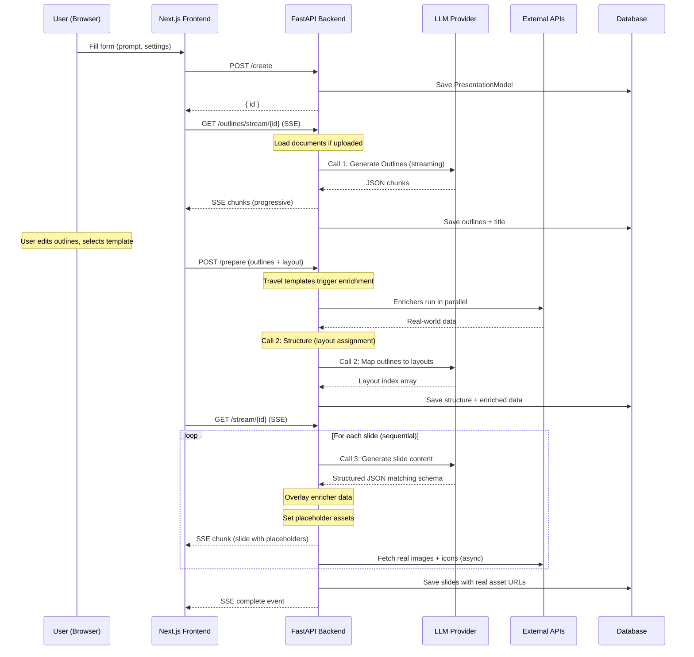
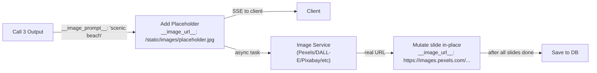
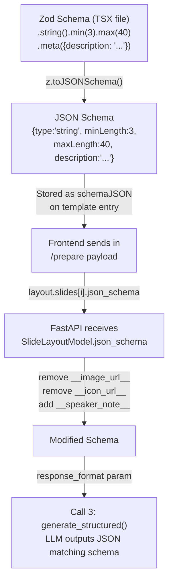

# TripStory Generation Pipeline -- Technical Workflow Reference

This document is the definitive reference for how TripStory generates a presentation from user input to rendered slides. It traces every stage of the pipeline, identifies where parallelism exists, and flags known issues and refactoring opportunities.

---

## 1. High-Level Flow



### API Call Sequence

| Step | Endpoint | Method | What Happens |
|------|----------|--------|--------------|
| 1 | `/api/v1/ppt/presentation/create` | POST | Persists prompt, settings, origin/currency. Returns `{ id }`. |
| 2 | `/api/v1/ppt/outlines/stream/{id}` | GET (SSE) | **LLM Call 1**: Generates slide outlines. Streams JSON chunks. Saves outlines to DB. |
| 3 | `/api/v1/ppt/presentation/prepare` | POST | Receives edited outlines + selected template layout. Runs enrichers (travel only). **LLM Call 2**: Assigns layouts. Saves structure + enriched data. |
| 4 | `/api/v1/ppt/presentation/stream/{id}` | GET (SSE) | **LLM Call 3**: Generates per-slide content. Overlays enricher data. Streams slides. Fetches assets in background. Saves final slides. |

---

## 2. The Three LLM Calls

### Call 1: Generate Outlines

**Purpose**: Turn the user's prompt into `n_slides` structured outline items (markdown strings).

**When**: During `/outlines/stream/{id}`, after document loading.

**Inputs**:
- `content` -- user's prompt text
- `n_slides` -- target slide count (adjusted for TOC if needed)
- `language` -- output language
- `additional_context` -- uploaded documents as markdown, PLUS enriched_context (for `/generate` path)
- `tone` -- e.g. "luxury", "adventurous", "professional"
- `verbosity` -- "concise" / "standard" / "text-heavy"
- `instructions` -- freeform user instructions
- `include_title_slide` -- boolean
- `web_search` -- enables search tool for grounding

**System Prompt** (condensed):
```
You are an expert travel content creator and destination specialist.
Generate compelling travel presentations that inspire booking decisions.
Structure content: inspiration -> logistics -> conversion.

[# User Instruction: {instructions}]     <-- conditional
[# Tone: {tone}]                          <-- conditional
[# Verbosity: {verbosity}]               <-- conditional

- Provide content for each slide in markdown format.
- Emphasize sensory destination details.
- Include practical travel logistics.
- Format prices with currency symbols.
- End with clear call-to-action.
- Always make first slide a title/destination hero slide.

**Search web for current travel advisories, visa requirements, pricing**
```

> **ISSUE**: This prompt says "travel content creator" for ALL templates, not just travel.

**User Prompt**:
```
**Input:**
- User provided content: {content}
- Output Language: {language}
- Number of Slides: {n_slides}
- Current Date and Time: {datetime.now()}
- Additional Information: {additional_context}
```

**Response Schema**: Pydantic model enforcing exactly `n_slides` items:
```json
{
  "type": "object",
  "properties": {
    "slides": {
      "type": "array",
      "minItems": N, "maxItems": N,
      "items": {
        "type": "object",
        "properties": {
          "content": { "type": "string", "minLength": 100, "maxLength": 1200 }
        },
        "required": ["content"]
      }
    }
  }
}
```

**LLM Method**: `stream_structured` (streaming with structured JSON output, `strict=True`).

**Output**: Array of `{ content: "<markdown>" }` per slide. Saved to `PresentationModel.outlines`.

---

### Call 2: Generate Structure (Layout Assignment)

**Purpose**: Map each outline to a layout index (which template slide design to use).

**When**: During `/prepare`, after enrichment, before returning.

**Skipped when**: `layout.ordered == True` (e.g. `travel-itinerary`) -- uses positional 1:1 mapping instead.

**Inputs**:
- Outline content from Call 1
- Layout descriptions (name + description per layout, NOT JSON schemas)

**System Prompt** (condensed):
```
You're a professional presentation designer with creative freedom.

## Presentation Layout
### Slide Layout: 0:
- Name: Destination Hero
- Description: Full-bleed destination opener with overlay text
### Slide Layout: 1:
- Name: Destination Highlights
- Description: 3-6 card grid of highlights with images
... (one entry per layout in the template)

# Layout Selection Guidelines
1. Content-driven choices (opening -> hero, data -> charts, etc.)
2. Visual variety (mix text-heavy and visual slides)
3. Audience experience (natural transitions)

Select layout index for each of {n_slides} slides.
```

**User Prompt**: The full outline content from Call 1:
```
## Slide 1:
  - Content: SlideOutlineModel(content='# Introduction...')
## Slide 2:
  - Content: SlideOutlineModel(content='# Market Analysis...')
```

> **ISSUE**: Uses Pydantic `__str__` representation, not raw content.

**Response Schema**:
```json
{ "slides": [int, int, ..., int] }   // exactly n_slides integers
```

**LLM Method**: `generate_structured` (non-streaming, `strict=True`).

**Post-processing**: Out-of-bounds indices are replaced with random valid indices.

> **ISSUE**: Call 2 only sees layout names/descriptions, NOT the JSON schemas. It can't make schema-aware decisions (e.g., "this outline has metrics data, layout 5 has a metrics schema").

---

### Call 3: Generate Slide Content

**Purpose**: Fill a specific layout's JSON schema with content derived from one outline.

**When**: During `/stream/{id}`, once per slide (sequentially in streaming path, batched in `/generate` path).

**Inputs per slide**:
- `slide_layout` -- the layout's JSON schema (from Zod -> `z.toJSONSchema()`)
- `outline` -- the markdown content for this slide (from Call 1)
- `language`, `tone`, `verbosity`
- `instructions` -- user instructions + `enriched_context` markdown (concatenated)

**Schema Transformation** (before sending to LLM):
1. `__image_url__` and `__icon_url__` fields are **stripped** (LLM generates prompts, not URLs)
2. `__speaker_note__` field is **injected** (100-250 chars, required)
3. All `.meta({ description })` from Zod become JSON Schema `description` fields
4. All `.min()/.max()` become `minLength`/`maxLength` constraints

**System Prompt** (condensed):
```
Generate structured slide based on provided outline.

[# User Instructions: {instructions + enriched_context}]
[# Tone: {tone}]
[# Verbosity: {verbosity}]

# Steps
1. Analyze the outline.
2. Generate structured slide.
3. Generate speaker note.

# Notes
- Follow max/min character limits strictly.
- Prices must include currency symbols.
- Image prompts should describe scenic travel photography.
- Star ratings must be numeric (1-5).
- Do not add emoji.

# Image and Icon Output Format
image: { __image_prompt__: string }
icon: { __icon_query__: string }
```

**User Prompt**:
```
## Current Date and Time
{datetime.now()}

## Icon Query And Image Prompt Language
English

## Slide Content Language
{language}

## Slide Outline
{outline.content}
```

**Response Schema**: The layout's JSON Schema, e.g. for Destination Hero:
```json
{
  "properties": {
    "title":    { "type": "string", "minLength": 3, "maxLength": 40,
                  "description": "Destination name or headline" },
    "tagline":  { "type": "string", "minLength": 5, "maxLength": 80,
                  "description": "Short inspirational tagline" },
    "country":  { "type": "string", "minLength": 2, "maxLength": 30 },
    "image":    { "__image_prompt__": { "type": "string" } },
    "__speaker_note__": { "type": "string", "minLength": 100, "maxLength": 250 }
  }
}
```

**LLM Method**: `generate_structured` (non-streaming, `strict=False`).

**Output**: A dict matching the schema. Example:
```json
{
  "title": "Discover Santorini",
  "tagline": "Azure waters and sun-kissed cliffs await",
  "country": "Greece",
  "image": { "__image_prompt__": "Santorini white buildings overlooking Aegean Sea at sunset" },
  "__speaker_note__": "Welcome everyone to our Santorini travel showcase..."
}
```

> **Per-Call Model Routing**: Since April 2026, the pipeline supports different models per call via `utils/llm_config.py`. Default production config: Call 1 uses GPT-5.5, Calls 2-3 use Mercury 2 (Inception Labs diffusion LLM) with `strict=True` and length constraints stripped via `utils/schema_utils.py` (validated client-side). Mercury 2 is 2.9-14.6x faster than GPT-4.1 for structured output.

---

## 3. Enrichment Pipeline

### When It Runs

Enrichment executes **before LLM Call 1** in the `/prepare` endpoint (streaming path) or before Call 1 in the `/generate` handler. It only triggers when `template.startswith("travel")`.

### Two-Pass Execution

```mermaid
flowchart LR
    subgraph pass1 [Pass 1: Primary Enrichers -- All Parallel]
        DI[Destination Intel]
        W[Weather]
        H[Hotels]
        F[Flights]
        IMG[Images]
        A[Activities]
        D[Dining]
        E[Events]
        R[Reviews]
        V[Videos]
        M[Maps]
        DL[Deals]
        VH[Visa/Health]
        TR[Transport]
        CO[Connectivity]
        LA[Language]
        CU[Cuisine]
    end

    subgraph pass2 [Pass 2: Derived -- Sequential]
        P[Pricing]
    end

    pass1 -->|"results dict"| pass2
    pass2 --> Output["enriched_context (markdown)\nenriched_data (JSON)"]
```



### How Enriched Data Flows Into LLM Calls

| Data | Call 1 (Outlines) | Call 2 (Structure) | Call 3 (Content) | Post-Call 3 |
|------|------|------|------|------|
| `enriched_context` (markdown) | Injected as `additional_context` in **user prompt** under "Additional Information" | Not injected | Injected as `instructions` in **system prompt** under "# User Instructions" | -- |
| `enriched_data` (raw JSON) | Not used | Not used | Not used directly | **Overlay**: `to_slide_data()` deep-merges factual fields (prices, ratings, times) onto LLM output |

> **ISSUE**: enriched_context is injected in two different positions across calls: user prompt (Call 1) vs. system prompt (Call 3). This inconsistency means the LLM treats the same data differently in each call.

---

## 4. Asset Pipeline

### The `__image_prompt__` -> `__image_url__` Flow



### Parallelism in Asset Fetching

**Streaming path** (`/stream/{id}`):
- Slide N's LLM call runs sequentially (blocks until complete)
- Slide N's asset fetch starts as `asyncio.create_task` immediately
- Slide N+1's LLM call begins while Slide N's assets are still fetching
- After ALL slides generated: `asyncio.gather` waits for all asset tasks

**Generate path** (`/generate`):
- Slides are generated in **batches of 10** via `asyncio.gather`
- After each batch: asset tasks for that batch start as background tasks
- Next batch of 10 LLM calls begins while previous batch's assets fetch

### Icon Resolution

Icons use ChromaDB vector similarity search against a pre-built collection of bold SVG icon names/tags, using ONNX MiniLM-L6-V2 embeddings. The `__icon_query__` is embedded and matched to the closest icon file.

---

## 5. Template-Schema-LLM Constraint Chain



### What Each Schema Layer Provides to the LLM

| Schema Feature | Example | LLM Guidance |
|---|---|---|
| `description` (from `.meta()`) | "Destination name or headline displayed prominently over the hero image" | Tells the LLM the semantic purpose of each field |
| `minLength` / `maxLength` | 3 / 40 | Hard length constraints (system prompt emphasizes "never exceed max") |
| `minItems` / `maxItems` | 2 / 6 (e.g. highlights array) | Array cardinality bounds |
| `default` (from `.default()`) | "Discover Santorini" | Example value (provides style/format guidance) |
| Nested object structure | `image: { __image_prompt__: string }` | Tells the LLM to generate an image prompt, not a URL |

---

## 6. Key Findings for Refactoring

### A. System Prompt is Travel-Hardcoded

**File**: `utils/llm_calls/generate_presentation_outlines.py`

The Call 1 system prompt says "You are an expert travel content creator and destination specialist" regardless of template. Non-travel presentations (general, modern, standard) get travel-specific instructions like "Emphasize sensory destination details" and "Search web for current travel advisories."

**Impact**: Non-travel presentations receive irrelevant travel guidance, potentially degrading quality for generic content.

**Fix**: Condition the system prompt persona and guidelines on the template group. Pass `template_name` to `generate_ppt_outline`.

### B. Call 3 is Sequential in Streaming Path

**File**: `api/v1/ppt/endpoints/presentation.py`, lines 340-387

The streaming path uses a plain `for` loop with `await` per slide. Each Call 3 LLM request blocks until the response arrives before the next slide begins. With 8 slides and ~5-10s per LLM call, this means 40-80 seconds of sequential LLM time.

The `/generate` path already batches 10 slides in parallel via `asyncio.gather`, taking only 5-10 seconds total. The streaming path can't directly parallelize (SSE must send slides in order), but it could fire multiple LLM calls ahead and buffer, or use a producer-consumer pattern.

**Impact**: Streaming path is 4-8x slower than it needs to be for the LLM portion.

### C. Call 2 Doesn't See JSON Schemas

**File**: `utils/llm_calls/generate_presentation_structure.py`

The structure generation prompt only shows the LLM layout names and natural-language descriptions (via `layout.to_string()`). It does NOT include the JSON schema for each layout. This means the LLM can't reason about which layouts have chart fields, which have image grids, which have pricing tiers, etc.

**Impact**: Layout assignment is based on name/description matching rather than structural compatibility. The LLM might assign a "metrics" outline to a layout that has no metrics fields.

**Fix**: Include a summary of each layout's schema fields (field names + types) in the prompt, or include the full JSON schema.

### D. `ordered` Flag is Broken in Frontend

**File**: `outline/hooks/usePresentationGeneration.ts`, line 131

The `usePresentationGeneration` hook hardcodes `ordered: false` when building the layout payload for `/prepare`. The `selectedTemplate.settings.ordered` value (which is `true` for travel-itinerary) is never read or passed.

**Impact**: The travel-itinerary template's fixed narrative sequence (hero -> highlights -> day -> accommodation -> flights -> pricing -> CTA) is never enforced. It falls through to LLM-based layout assignment like any other template.

**Fix**: Read `selectedTemplate.settings?.ordered ?? false` and pass it in the layout object.

### E. Enriched Context Injection Inconsistency

**Files**: `generate_presentation_outlines.py` (Call 1), `generate_slide_content.py` (Call 3)

In Call 1, enriched context goes into the **user prompt** as "Additional Information."  
In Call 3, enriched context goes into the **system prompt** as "# User Instructions."

This means the LLM treats the same enricher data with different authority levels across calls. System prompt content is generally weighted more heavily by LLMs than user message content.

### F. Outline `to_string()` Uses Pydantic `__str__`

**File**: `models/presentation_outline_model.py`, line 14

The `to_string()` method for passing outlines to Call 2 renders each slide as `SlideOutlineModel(content='...')` (Pydantic's default repr) rather than just the raw content string. This wastes tokens and adds noise.

**Fix**: Change `{slide}` to `{slide.content}` in the `to_string()` method.

---

## 7. Operation Timeline (Streaming Path)

```
TIME ──────────────────────────────────────────────────────────────────────►

/create                                    /prepare                         /stream/{id}
   │                                          │                                │
   ├─ Save to DB                              │                                │
   │                                          │                                │
/outlines/stream/{id}                         │                                │
   │                                          │                                │
   ├─ Load documents (if uploaded)            │                                │
   ├─ ████ CALL 1: Outlines (streaming) ████  │                                │
   ├─ Save outlines to DB                     │                                │
   │                                          │                                │
   │   [User edits outlines, picks template]  │                                │
   │                                          │                                │
   │                                ██ ENRICHMENT (parallel) ██                │
   │                                ├─ 17 primary enrichers ─┐                 │
   │                                │  (asyncio.gather)      │                 │
   │                                ├─ derived enrichers ────┘                 │
   │                                ├─ itinerary scheduling                    │
   │                                ├─ Save enriched_context + enriched_data   │
   │                                │                                          │
   │                                ██ CALL 2: Structure ██                    │
   │                                ├─ Save structure                          │
   │                                                                           │
   │                                                        ██ CALL 3 LOOP ██
   │                                                        │
   │                                                        ├─ Slide 0: Call 3 (await)
   │                                                        │  ├─ Overlay enricher data
   │                                                        │  ├─ Set placeholders
   │                                                        │  ├─ SSE → client
   │                                                        │  └─ START asset fetch ──┐
   │                                                        │                         │ (parallel)
   │                                                        ├─ Slide 1: Call 3 (await)│
   │                                                        │  ├─ Overlay + placeholders
   │                                                        │  ├─ SSE → client        │
   │                                                        │  └─ START asset fetch ──┤
   │                                                        │                         │
   │                                                        ├─ ... Slide N            │
   │                                                        │                         │
   │                                                        ├─ AWAIT all asset tasks ─┘
   │                                                        ├─ Save slides + assets to DB
   │                                                        └─ SSE complete event
```

**Where time is spent** (typical 8-slide travel presentation):

| Phase | Duration | Bottleneck |
|-------|----------|------------|
| Enrichment (17 parallel API calls) | 2-5s | Slowest external API |
| Call 1: Outlines (streaming) | 10-30s | LLM generation speed |
| Call 2: Structure | 2-5s | Single LLM call |
| Call 3 x 8 slides (sequential) | 40-80s | **Biggest bottleneck** -- sequential LLM calls |
| Asset fetching (parallel per slide) | 5-15s | Overlaps with Call 3 loop |
| **Total wall time** | **~60-130s** | |

If Call 3 were parallelized (like the `/generate` path), the 40-80s would collapse to 5-10s, cutting total time roughly in half.
