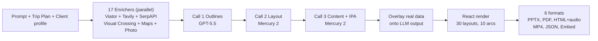

# TripStory — Stakeholder Briefing

> A single-source briefing on what TripStory is, what's shipped, why it's defensible, who buys it, and what's next.
> Last updated: May 3, 2026. Companion docs: [README.md](README.md), [VISION.md](VISION.md), [REFACTOR-PIVOT.MD](REFACTOR-PIVOT.MD), [FEAT-EXPANSION.md](FEAT-EXPANSION.md), [FEATURE-BUILDING.md](FEATURE-BUILDING.md), [EXPORTS.md](EXPORTS.md), [main-workflow.md](main-workflow.md), [DEPLOYMENT.md](DEPLOYMENT.md), [docs/CREATIVE-RECIPES.md](docs/CREATIVE-RECIPES.md), [docs/RECAP-CRON-RECIPES.md](docs/RECAP-CRON-RECIPES.md).

---

## 1. Elevator Pitch

TripStory is the AI travel-presentation engine for travel agents, BDMs, tour operators, and destination marketing organizations. It turns a destination and a client brief into a polished, bookable proposal in 60-130 seconds — grounded in real supply data (Viator, Tavily, Visual Crossing, SerpAPI, Google Maps, Unsplash, Pexels), narrated end-to-end with ElevenLabs voice, and exportable to six formats so the proposal meets the buyer wherever they read it: PPTX, PDF, HTML with audio, MP4 video, structured JSON, or embeddable iframe.

Open-source under Apache 2.0. Self-hostable. Model-agnostic across six LLM providers. MCP-ready for AI agents.

Anchor product fact: TripStory does not invent hotels, prices, weather, or activities. The enrichment pipeline pulls verified facts first; the LLM writes narrative around them.

---

## 2. The Problem We're Solving

The travel agent's proposal-building workflow is broken in four ways at once:

- **It's slow.** Building a personalized destination proposal in PowerPoint or Canva takes 4-8 hours per client. That's the difference between landing 50 trips a year and landing 200.
- **It hallucinates.** Generic AI tools (ChatGPT, Canva Magic Studio, Gamma, Beautiful.ai) invent hotel names, fabricate prices, get visa rules wrong, and pull stale weather. The agent fact-checks every line, which defeats the time savings.
- **It's locked in.** Travel CRMs (Travefy, Tourwriter, ClientBase) hold client data hostage and offer no native AI generation. Data lives on their servers, not yours.
- **It's the wrong shape.** Modern buyers consume proposals on phones, in DMs, on social. A 30 MB PowerPoint attachment hits roughly 10% of the surface area where booking decisions actually get made.

TripStory closes all four gaps in one system: real-data grounding (no hallucination), AI-native generation (60-130s vs hours), self-hostable open source (no lock-in), and six-format output (every distribution channel).

---

## 3. The Three Differentiating Layers

The product is built on three layers that compound. Any one of them on its own is a feature; together they are a defensible position.

### Layer 1 — Real-Data Foundation [LIVE]

The enrichment pipeline (`servers/fastapi/enrichers/`) runs **17 enrichers + 1 derived** against external supply APIs in parallel before any LLM call. Real hotel prices, real flight schedules, real Viator-bookable experiences with deep links, real reviews, real weather, real photography. The LLM's job is to write narrative around verified facts, not to invent them.

The graceful-degradation rule is enforced by architecture: every enricher is independent and optional. Missing API keys mean an enricher returns empty data; the pipeline continues; the LLM falls back to its existing behavior. **No enricher can break the pipeline; they only make it better.** See [FEAT-EXPANSION.md](FEAT-EXPANSION.md) for the full enricher reference.

### Layer 2 — Audio-First Travel Storytelling [LIVE]

Narration isn't a bolt-on. Each deck ships as a performable audio experience.

- **ElevenLabs eleven_v3** synthesis with four curated tone presets: `travel_companion`, `documentary`, `hype_reel`, `friendly_tutorial`.
- **Auto-IPA phoneme augmentation** — destination names like Reykjavík, Côte d'Azur, Phuket get pronunciation tags injected automatically using a curated dictionary plus destination-context boost plus LLM fallback.
- **Pronunciation dictionary management** — agencies can upload custom dictionaries for client-specific pronunciations.
- **Per-slide and monthly character budget enforcement** via `narration_usage_logs` table.
- **Usage dashboard** at `/settings/narration-usage` with day/week/month rollups.
- **Soundtrack-mode video export** muxes per-slide narration directly into the MP4 timeline.

This is genuinely novel. No competitor in travel-deck tooling ships pronunciation-aware narration as a first-class output. See [README narration section](README.md#narration-via-api) and [`servers/fastapi/services/auto_ipa_service.py`](servers/fastapi/services/auto_ipa_service.py).

### Layer 3 — Six-Format Export Pipeline [LIVE]

One generation, every distribution channel:

- **PPTX** — editable in PowerPoint or Google Slides (python-pptx via Puppeteer DOM walk)
- **PDF** — print-ready (Puppeteer page.pdf)
- **HTML zip bundle** — self-contained slideshow with optional `audio/slide_*.mp3` and `narration_manifest.json`
- **MP4 video** — Hyperframes + GSAP timeline with five transition styles, async job pipeline with progress polling
- **JSON** — structured `PresentationWithSlides` model for CRM/API consumers
- **Interactive embed** — `/embed/{id}` route with iframe code generator

Most competitors stop at PPTX-or-PDF. TripStory turns the same content into the format the buyer's channel demands. See [EXPORTS.md](EXPORTS.md) for the complete reference.

---

## 4. Capability Inventory

The shipped product surface, organized for stakeholder skim. Every item below is in production.

### A. Generation Engine [LIVE]

| Feature | Detail |
|---|---|
| 3-call LLM pipeline | Outlines → Layout assignment → Content fill |
| Per-call model routing | Call 1: GPT-5.5 (reasoning); Calls 2-3: Mercury 2 (Inception Labs diffusion LLM, 2.9-14.6x faster than GPT-4.1 for structured output) |
| Travel layouts | 30 layouts in 3 categories (emotional/sensory hooks, logistics/practical, conversion) plus the interactive Pricing Configurator widget |
| Narrative arcs | 10 ordered template sequences: `travel-itinerary`, `travel-reveal`, `travel-contrast`, `travel-audience`, `travel-micro`, `travel-local`, `travel-series`, `travel-recap`, `travel-deal-flash`, `travel-partner-spotlight` |
| Ordered mode | `ordered: true` templates skip Call 2 entirely (positional layout mapping) |
| Web grounding | `WebSearchTool()` invoked autonomously by LLM during outline generation |
| Auto slide-count | Computed from trip duration |
| Field-level AI editing | `PATCH /api/v1/ppt/slide/edit-field` — single-field LLM edit with type coercion |

### B. Real-Data Enrichment [LIVE]

| Enricher | Source API | What It Provides |
|---|---|---|
| `destination_intel`, `visa_health`, `transport`, `connectivity`, `language`, `deals` | Tavily / Firecrawl | Facts, tips, requirements, advisories, deals |
| `hotels`, `flights`, `dining`, `events`, `reviews`, `videos`, `cuisine` | SerpAPI | Real prices, schedules, reviews, signature dishes |
| `activities` | Viator Partner API | Bookable tours with pricing, availability flags, deep booking URLs |
| `weather` | Visual Crossing | Forecast for travel dates |
| `images` | Unsplash, Pexels | Destination photography (replaces AI-generated placeholders) |
| `maps` | Google Maps Static | Route maps with markers |
| `pricing` | Derived | Budget/comfort/luxury tier computation from hotels + flights + activities |

Itinerary scheduler distributes activities across trip days with category diversity. 7-day Viator destination resolver cache. Post-processing overlay deep-merges factual fields onto LLM output.

### C. Narration & Audio [LIVE]

| Feature | Detail |
|---|---|
| Voice synthesis | ElevenLabs eleven_v3 with curated fallback voices per tone |
| Tone presets | 4 canonical: travel_companion, documentary, hype_reel, friendly_tutorial |
| Auto-IPA | Curated dictionary → destination context boost → LLM batch fallback |
| Pronunciation dictionary | Upload + async replacement of previous `dictionary_id` |
| Per-slide character cap | `ELEVENLABS_MAX_CHARS_PER_SLIDE` |
| Monthly budget | `ELEVENLABS_MONTHLY_CHARACTER_BUDGET` enforced via SQL on `narration_usage_logs` |
| Bulk synthesis | Bounded concurrency via `ELEVENLABS_BULK_CONCURRENCY` (default 3, max 12) |
| Usage dashboard | `GET /api/v1/ppt/narration/usage/summary?period=day\|week\|month` |
| Audio persistence | `/app_data/audio/{presentation_id}/slide_*.mp3` |

### D. Export & Sharing [LIVE]

| Format | Endpoint | Notes |
|---|---|---|
| PPTX | `POST /api/v1/ppt/presentation/export` | Editable in PowerPoint/Google Slides |
| PDF | `POST /api/v1/ppt/presentation/export` | Print-ready |
| HTML zip | `POST /api/v1/ppt/presentation/export` | With optional audio bundle + manifest |
| MP4 video | `POST /api/v1/ppt/presentation/export` | 5 transition styles; async job + polling |
| JSON | `GET /api/v1/ppt/presentation/export/json/{id}` | CRM/API consumer |
| Embed | `POST /api/export-as-embed` | Iframe code generator |
| Showcase view | `/embed/{id}?mode=showcase` | Looped self-led kiosk preset, interactive widgets enabled, `is_public` flag for public sharing |
| Agent profile defaults | `GET/PATCH /api/v1/ppt/profile` | Singleton brand identity (agent, agency, logo, booking URL, UTM defaults) |
| Branded export overlays + UTM | `export_options` | Contact-card watermark + cross-format UTM tagging on booking links (PPTX/PDF/HTML/MP4); canonical implementation in [`servers/nextjs/lib/apply-utm-tags.ts`](servers/nextjs/lib/apply-utm-tags.ts) |
| Lead-magnet PDF + email-safe HTML | `export_options` | `lead_magnet: true` adds branded cover/back wrapper around the PDF; `email_safe: true` emits single-column max-600px HTML with narration as `<a href>` links (no JS) |
| Campaign generator | `POST /api/v1/ppt/campaign/generate` | Async multi-variant creative generation from one brief + status polling |
| Recap mode | `POST /api/v1/ppt/presentation/recap` | Post-trip lifecycle content (`welcome_home`, `anniversary`, `next_planning_window`) |
| Multi-aspect export | `export_options.aspect_ratio` | Landscape/vertical/square output for PPTX/PDF/HTML/video routes |
| Saved campaign presets | `lib/campaign-presets.ts` + `/api/v1/ppt/campaign-presets` | Persist multi-variant bundles per agent for quick re-use across campaigns |
| Schedule-this-recap | `ScheduleRecapModal.tsx` + [`docs/RECAP-CRON-RECIPES.md`](docs/RECAP-CRON-RECIPES.md) | Generate cron / GitHub Actions snippets to automate post-trip recap delivery |
| Bulk recap | `source_presentation_ids` on `/presentation/recap` | Generate recap decks across multiple past trips in one click |
| Recent activity panels | `/api/v1/ppt/activity` + `<RecentActivityCard>` | Surface last 5 campaigns / recaps in dashboard sidebars with click-through |
| End-of-campaign hero summary | `CampaignPage.tsx` hero summary | Replace row-list with a celebratory artifact grid + Send-to-client `mailto:` when all variants complete |

Async video export at `/api/export-as-video` returns `{ jobId, statusUrl }` immediately; status reports `progressPct`, `currentFrame`, `totalFrames`. File-backed job store with 24-hour reaper.

### E. AI Agent Integration (MCP) [LIVE]

MCP server at `/mcp/` exposes **22 tools** auto-registered from the FastAPI OpenAPI spec, including `generate_presentation`, `get_presentation`, `export_presentation`, `edit_slide_field`, `get_enricher_status`, `list_presentations`, `templates_list`, `bulk_generate_narration`, `narration_estimate`, `get_narration_voices`, `get_narration_status`, `get_embed_url`, `export_json`, `generate_async`, `generate_campaign`, `get_campaign_status`, `generate_recap`, `get_agent_profile`, `update_agent_profile`, `get_campaign_presets`, `update_campaign_presets`, and `get_activity_feed`. Works in Cursor, Claude Desktop, n8n, and any MCP-compliant agent. See [EXPORTS.md Section 9](EXPORTS.md#9-mcp-integration) for the canonical tool table.

### F. Editing & Customization [LIVE]

| Feature | Detail |
|---|---|
| Theme registry | 4 themes: eggshell-light, eggshell-dark, velara-light, velara-dark (toggled via `next-themes` `data-theme` attribute) |
| Inline text editing | Tiptap with markdown + formatting |
| Image swap | Upload, AI-generate, or stock-photo search |
| Icon swap | ChromaDB vector search of bold SVGs (ONNX MiniLM-L6-V2 embeddings) |
| Chart data editor | Dialog-based table for Recharts data arrays |
| Drag-reorder | @dnd-kit for slides + outlines |
| Undo/redo | 30-state history |
| Template groups | 14+ groups: general, modern, swift, neo-* variants, code, education, product-overview, report, travel + 10 travel narrative arcs |
| Custom templates | Upload `.pptx`/`.ppt`/`.pptm`/`.odp` → AI conversion to React + Zod entry; UUID-prefixed groups compiled at runtime via `@babel/standalone` |

### G. Document Import & Context [LIVE]

| Input | Pipeline |
|---|---|
| PDF, Word, PPTX, ODP, spreadsheets, images | LiteParse (LlamaIndex) + LibreOffice + Tesseract OCR |
| Upload cap | 250 MB (frontend, backend validators, nginx aligned) |
| Processing cap | First 25 slides per deck (UI warns on truncation) |
| Trip Plan popover | Destination, origin, duration, budget tier, trip type |
| Client CRM sheet | Localstorage profiles for personalization (`tripstory_clients`) |
| Per-presentation memory | Mem0 OSS layer with FastEmbed (BAAI/bge-small-en-v1.5, 384 dims) |

### H. Privacy & Deployment [LIVE]

| Capability | Status |
|---|---|
| Self-hosted Docker single-container | Apache 2.0, single `docker run` |
| Local LLMs | Ollama support out of the box |
| Local image generation | ComfyUI, Open WebUI |
| LLM providers | 6: OpenAI, Google Gemini, Anthropic Claude, Ollama, custom OpenAI-compatible, ChatGPT Codex (OAuth) |
| Image providers | 7: DALL-E 3, GPT Image 1.5, Gemini Flash, Pexels, Pixabay, ComfyUI, Open WebUI |
| Database | SQLite default; PostgreSQL/MySQL via `DATABASE_URL` |
| Air-gapped deploy | Possible (no required outbound calls when keys/providers point local) |
| Single-admin auth | HTTP Basic on all `/api/v1/*` routes; preseeded via env or stored hashed |

---

## 5. The Pipeline at a Glance

One prompt becomes verified data, structured slides, and six output formats — automatically. This diagram is the engineering investment in a single visual; deeper detail in [main-workflow.md](main-workflow.md).

Wall-clock for an 8-slide travel presentation: roughly 60-130 seconds end-to-end, dominated by the sequential Call 3 content fill (a known optimization target — see Section 10 risks).

---

## 6. Technical Moats

Six items, each defensible in its own right. Together, they compound.

- **17-enricher graceful-degradation pipeline.** Eight-plus supply API integrations plus the orchestration framework, scheduler, overlay logic, and post-processing. A clone has to build all of it before reaching parity. See [FEAT-EXPANSION.md](FEAT-EXPANSION.md).

- **Zod → JSON Schema → LLM structured output chain.** Every layout's data contract is declared once in TypeScript and enforced through the entire pipeline via `z.toJSONSchema()` plus per-call schema preprocessing (`utils/schema_utils.py`). Layout-safe output by construction; competitors with free-form prompts get layout breakage that requires manual cleanup.

- **Auto-IPA + curated dictionary + destination-context boost.** Pronouncing destination names correctly is the single biggest tell separating a polished narrated proposal from a cringeworthy one. The IPA augmentation pipeline (`services/auto_ipa_service.py`) is non-trivial domain expertise.

- **Showcase mode + interactive widgets.** The same linear deck can be rendered as a kiosk-style, self-led experience (`/embed/{id}?mode=showcase`) with viewer-facing tools (pricing calculators, AI hotspots) that static files cannot match.

- **Per-call model routing.** Mixing GPT-5.5 (reasoning model for outlines) with Mercury 2 (diffusion model for structured fill) is a 2.9-14.6x speedup compared to monolithic GPT-4.1. Wired through `utils/llm_config.py` and the four docker-compose service blocks.

- **MCP-server-first design.** TripStory ships with an MCP server today, positioning it as agent infrastructure rather than a tool. AI assistants (Claude Desktop, Cursor, n8n) can drive presentation generation programmatically. This is a distribution moat — not a feature.

- **Apache 2.0 + self-hostable.** Privacy-conscious enterprises (corporate travel desks, government, defense, agencies with NDA-bound itineraries) cannot use SaaS-only tools. TripStory's open-source license and single-container Docker deploy unlock that segment of the TAM that is structurally closed to closed-source competitors.

---

## 7. Market Positioning Matrix

| Category | Examples | TripStory wins on | Where competitors win |
|---|---|---|---|
| Generic AI deck tools | Beautiful.ai, Canva Magic Studio, Gamma, Tome | Real travel data, 30 travel layouts, narration, MCP-native, six-format output | Brand recognition, breadth across non-travel use cases |
| Travel CRMs and proposal tools | Travefy, Tourwriter, ClientBase, AXUS | AI generation, modern UX, six-format export, narration, open source | Booking integration depth, established commission flows |
| PowerPoint / Canva (status quo) | — | Speed (60-130s vs 4-8h), data accuracy, video and embed sharing | Familiarity, zero learning curve |
| In-house AI at large agencies | Bespoke builds | Packaged solution, open-source ownership, MCP integration, privacy-friendly | Bespoke fit to internal workflow |

The honest read: TripStory is not trying to displace travel CRMs at the booking layer. It is purpose-built to displace the **proposal-building** workflow that currently happens in PowerPoint, Canva, or hand-edited Travefy templates. It complements booking platforms via deep links rather than competing on inventory.

---

## 8. ICP and Go-to-Market

### Who buys it

- **Primary**: Independent travel agents and BDMs at agencies (50-200 trips/year, no in-house tech, currently using PowerPoint, Canva, or Travefy templates). The pain is acute and the value is immediate.
- **Secondary**: Tour operators, destination marketing organizations (DMOs), corporate travel managers, small luxury travel brands. Higher contract values, longer sales cycle, but recurring usage.
- **Tertiary**: AI-assistant developers and platform builders who want to embed travel proposal generation in their own products via MCP. Volume play, low CAC.

### Distribution channels

| Channel | Status | Notes |
|---|---|---|
| SaaS web app | LIVE | `https://presenton-app.azurewebsites.net` (Azure App Service B2) |
| Self-hosted Docker | LIVE | Apache 2.0, single `docker run` with mounted `app_data` |
| MCP integration | LIVE | Works in Cursor, Claude Desktop, n8n, any MCP-compliant agent |
| Marketing website with freemium tier | PLANNED | Standalone Next.js site at `servers/marketing/` (port 3001), product app moves under `/app/*` via Next.js `basePath` |
| Enterprise/agency white-label | PLANNED | Multi-tenant architecture and custom branding |

### Open source as a GTM lever

The Apache 2.0 license + single-container deploy is not just compliance theater. It is a deliberate funnel:

1. Developer adoption (open source) → trust + word-of-mouth
2. Self-hosters generate ongoing usage signal + feature requests
3. The privacy-conscious enterprise tier follows naturally — they evaluate the source, run a private Docker, then upgrade to managed support or hosted deployment

This is the same model as Sentry, PostHog, and Mattermost. It works because the moat is in the integration depth (enrichers + narration + MCP), not in the source code itself.

---

## 9. Status Snapshot

### Live in production

Phases 0-12 of the travel pivot are complete and deployed at `https://presenton-app.azurewebsites.net`. Specifically:

- All 30 travel layouts and 10 narrative arcs registered in both frontend (`presentation-templates/index.tsx`) and backend (`constants/presentation.py`)
- 17 enrichers + 1 derived (pricing), with auto-discovery and graceful degradation
- All 6 export formats wired to the UI export dropdown
- Showcase mode + Pricing Configurator widget + AI Q&A hotspot (with `is_public`-gated public sharing)
- ElevenLabs narration with usage tracking, monthly budgets, IPA augmentation
- MCP server at `/mcp/` with 22 tools (see [EXPORTS.md Section 9](EXPORTS.md#9-mcp-integration))
- Eggshell Bright Tech theme system (4-theme registry)
- Async video export job pipeline with file-backed status store and progress polling
- Azure App Service deployment with `/health` monitoring, single-command redeploy script (`scripts/redeploy-azure.sh`), end-to-end smoke harness (`scripts/smoke-narration.sh`)
- TripStory rebrand (user-visible strings); code identifiers retained as "presenton" intentionally
- Phase 3 strategic UX features (saved campaign presets, scheduled-recap cron / GitHub Actions generator, bulk recap, recent activity feeds, built-in template categorization, CRM-aware Past trips filter, end-of-campaign hero summary) all live on `feat/ux-ui-improvements`

### In flight or planned

- Marketing site at `servers/marketing/` — fully planned, not yet implemented [PLANNED]
- Dark mode Phase 2 — ~68 files with `bg-white`, ~59 with hardcoded grays still to convert [IN FLIGHT]
- TripStory visual asset replacement — logo PNGs in `/public/` not yet rebranded [IN FLIGHT]
- Booking-grade APIs (Amadeus or Skyscanner for flights, Booking.com or Expedia for hotels) [PLANNED]
- Interactive map embeds (Mapbox or Google Maps JavaScript) replacing static map images [PLANNED]
- Anthropic prompt caching for Call 3 (~90% prefix-reuse savings on 7+ slide decks) [PLANNED]
- Sequential Call 3 streaming parallelization (4-8x speedup on the streaming path) [PLANNED]

---

## 10. Strategic Roadmap and Risks

### Roadmap

#### Q3 2026

- Marketing site launch (`servers/marketing/`) with public landing, features, pricing, embedded product demos via the existing `/embed/{id}` route
- Multi-tenant architecture (PostgreSQL via `DATABASE_URL` already supported; row-level scoping needed)
- QR codes on exported decks pointing to interactive embed view
- `presentations.recap_mode` column migration so recap activity feeds can use exact mode filtering instead of title-substring heuristics

#### Q4 2026

- Direct booking API integration (selecting between Amadeus and Booking.com based on partner economics)
- Interactive map embeds with route polylines and click-to-navigate markers
- Multi-currency live pricing
- Agency white-label option (custom domain, custom branding, isolated tenant)
- Built-in recap scheduler with backend persistence (replacing the current localStorage-only cron/GitHub Actions recipe helper)

### Risks and mitigations

| Risk | Likelihood | Mitigation |
|---|---|---|
| LLM cost variability on high-traffic deployments | Medium | Per-call model routing already shipped — GPT-5.5 only for Call 1; Mercury 2 for high-volume Calls 2-3. Anthropic prompt caching planned. |
| Supply API rate limits (Viator, SerpAPI, Tavily) | Medium | Graceful degradation rule prevents pipeline breakage; 7-day Viator destination resolver cache; future: Redis-backed enricher cache layer. |
| ElevenLabs character costs scaling unpredictably | Medium | Per-slide cap (`ELEVENLABS_MAX_CHARS_PER_SLIDE`) and monthly budget (`ELEVENLABS_MONTHLY_CHARACTER_BUDGET`) enforced from the [`narration_usage_logs`](servers/fastapi/alembic/versions/9d2f4f8429de_add_narration_usage_log.py) table. Usage dashboard surfaces overruns. |
| Open-source clone risk | Low-medium | Moats compound: enricher integration depth + IPA expertise + 30 layouts + MCP-native design. Network effects from agency CRM adoption add switching cost. |
| Single-admin auth model limits multi-user agencies | Medium | Multi-tenant architecture in Q3 roadmap; row-level scoping ready (DB schema already supports). |
| Azure App Service video export ceiling (Hyperframes screenshot mode) | Known | Async job pipeline + HTML zip with audio manifest + ffmpeg-outside-Azure workaround documented in [TROUBLESHOOTING.md](TROUBLESHOOTING.md). Local Docker renders full decks in seconds. |

---

## TL;DR for time-constrained readers

- **Product**: AI travel-presentation engine. Real data, narrated audio, six export formats. Apache 2.0 open source.
- **Differentiation**: 17-enricher real-data foundation + ElevenLabs narration with IPA + six-format export. No competitor ships all three.
- **Status**: Live in production at `https://presenton-app.azurewebsites.net`. Phases 0-12 of the travel pivot complete.
- **Buyer**: Travel agents, BDMs, tour operators, DMOs. Selling proposals, not bookings.
- **Distribution**: SaaS (live), self-hosted Docker (live), MCP for AI agents (live). Marketing site and white-label tier planned.
- **Moat**: Domain-specific enricher depth + pronunciation expertise + agent-ready MCP architecture + open-source enterprise-friendly licensing.
- **Next**: Marketing site, booking-grade APIs, interactive maps, multi-tenant architecture.

For deeper drill-downs, see [README.md](README.md) (quickstart), [main-workflow.md](main-workflow.md) (pipeline internals), [EXPORTS.md](EXPORTS.md) (export reference), [FEATURE-BUILDING.md](FEATURE-BUILDING.md) (content syndication master plan, Phases 0-6), [REFACTOR-PIVOT.MD](REFACTOR-PIVOT.MD) (build history), [DEPLOYMENT.md](DEPLOYMENT.md) (Azure ops), [TROUBLESHOOTING.md](TROUBLESHOOTING.md) (production runbook), [docs/CREATIVE-RECIPES.md](docs/CREATIVE-RECIPES.md) (curl recipes per creative shape), [docs/RECAP-CRON-RECIPES.md](docs/RECAP-CRON-RECIPES.md) (lifecycle recap scheduling).
